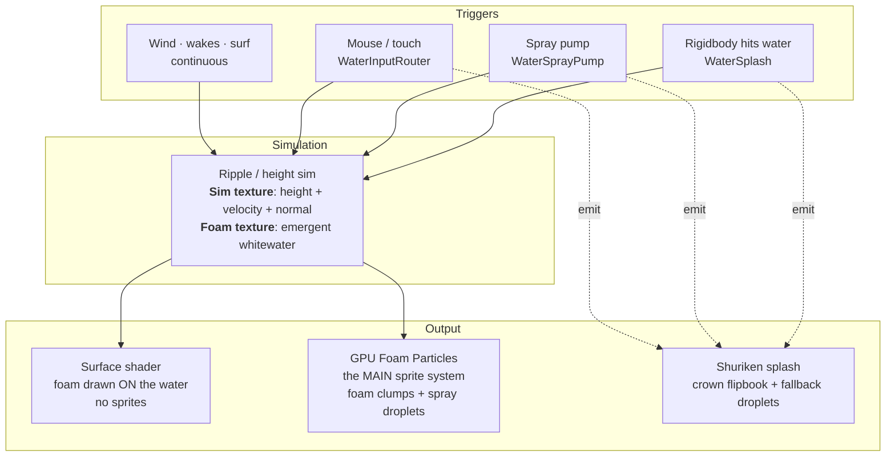
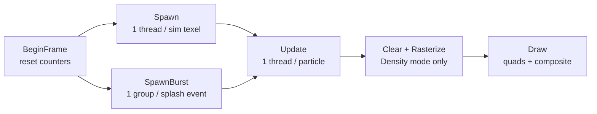
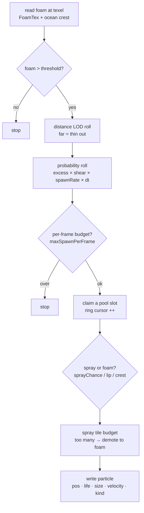
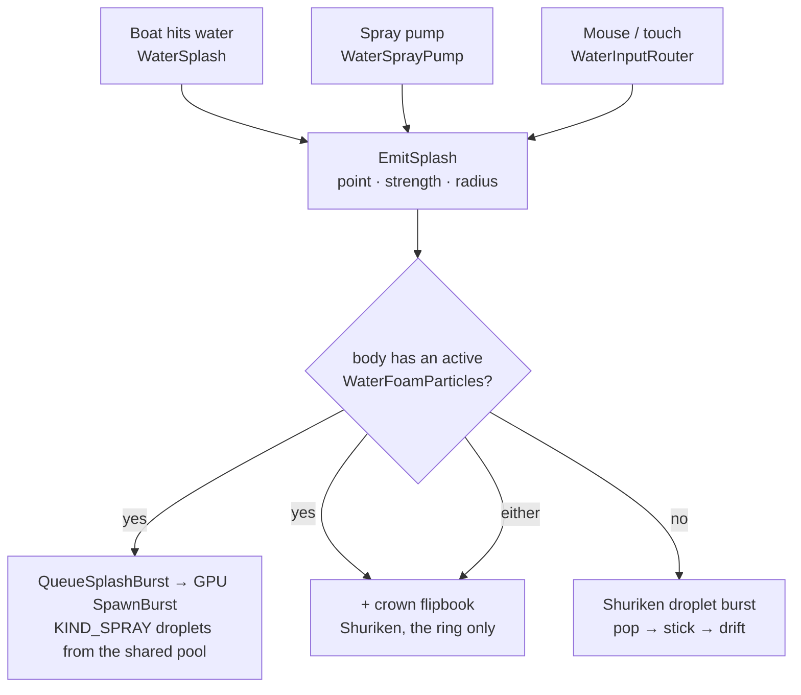

# WebGpuWater — Particle & Foam System

How foam and spray are spawned: what gets spawned, where it comes from, and when. This
page is the conceptual map behind `WaterFoamParticles`, `WaterSplashEmitter`, and
`WaterFoamProfile`.

> **The one idea to hold:** there is not one particle system, there are **two** — plus a
> water simulation that feeds them. Events never spawn a droplet directly. They disturb a
> **simulation** (a couple of GPU textures), and the particle systems read those textures
> to decide what to spawn. The flow is always *event → simulation → particles*.

---

## 1. The big picture — three layers

Foam appears along wakes, whitecaps, and shorelines "for free" because the sim writes
turbulence into the **foam texture**, and the particle system spawns from that texture —
not from the boat or the collision.

Two things are loosely called "the splash":

- **GPU Foam Particles** (`WaterFoamParticles`) — a custom, fully-GPU particle pool (no
  Unity Shuriken). Throws **both** the floating foam clumps **and** the airborne spray
  droplets. This is the workhorse.
- **Shuriken splash** (`WaterSplashEmitter`) — a normal Unity `ParticleSystem`. When the
  GPU system is present it plays only the **crown** (the ring-shaped splash sprite at the
  impact point); the droplets are handed to the GPU. With no GPU system on the body, it
  falls back to throwing its own droplet burst.

---

## 2. The GPU foam pool — one frame at a time

The GPU system keeps a fixed **pool** of particles in a GPU buffer. A `FoamParticle` is
12 floats: position, velocity, age, life, size, seed, kind, strength. The pool size is
rounded up to a power of two and capped by the device quality tier (`Foam-particle cap`).
There is no create/destroy — a **ring cursor** walks the buffer and overwrites the oldest
particle when it wraps. Every slot is drawn every frame; dead slots collapse to invisible
(degenerate) triangles.

Each frame `WaterFoamParticles.LateUpdate` dispatches six compute kernels:

The two spawn kernels are the heart of *what* and *when*:

- **`Spawn`** — the **continuous** source. One thread per sim texel, every frame. Where the
  foam texture is strong, it rolls the dice and maybe spawns a particle there.
- **`SpawnBurst`** — the **event** source. Consumes a queue of splash requests (a boat
  impact, the spray pump, a mouse click) and throws a ring of droplets per request.

---

## 3. What gets spawned — two kinds

Every particle carries a `kind`. This is the key distinction:

| Kind | Born | Moves | Ends |
| --- | --- | --- | --- |
| **`KIND_SURFACE`** (foam) | on the surface | drifts with the flow, swirls & clumps | slowly fades over its life |
| **`KIND_SPRAY`** (droplet) | just above the surface | launched up, arcs under gravity | lands → **becomes surface foam** |

Because a spray droplet that lands is converted into floating foam, spray naturally turns
into foam trails.

**How the kind is chosen:**

- In the **continuous** `Spawn` kernel: a random roll against `sprayChance` decides foam vs
  spray. A breaking surf lip or ocean crest **forces** spray. If one screen tile already
  has too much spray, the extra is demoted back to foam (a per-tile budget).
- In the **event** `SpawnBurst` kernel: droplets are **always** spray — that is the point of
  a splash.

---

## 4. The continuous source — the `Spawn` decision

Runs for every sim texel, every frame. This is why foam hugs wakes and shorelines
automatically. The gauntlet, in order:

Two subtleties that explain *why foam appears here*:

- **Shear boost** — texels at the edge of a wake (fast water beside still water) get a
  higher spawn chance, so foam clings to wake edges and interactor rims.
- **Resolution-independent density** — the probability is normalised by each texel's real
  world area, so a big lake and a small pool get the same foam *per square metre*.

---

## 5. The event source — a splash, end to end

This is the path a boat impact, a mouse click, **and** the spray pump all share.
Everything funnels through one method, `WaterSplashEmitter.EmitSplash(point, strength,
radius)`, which forks on whether the body has a GPU foam system:

`strength` and `radius` are what each trigger computes and hands over; droplet count,
launch speed, and opacity all scale from them, which is why one droplet look serves every
source. For the spray pump `strength` is the normalised closing/plow speed; for a boat it
is the impact speed.

> **The spray pump is purely a new *trigger*.** It adds no new particles or rendering — it
> only decides *when* to call `EmitSplash`, based on how fast the water and a floating probe
> close on each other. From `EmitSplash` onward it is identical to a boat impact.

---

## 6. Crown vs fallback — the common confusion

`WaterSplashEmitter` bundles **two different things**, and only one of them is a fallback:

| Piece | GPU foam present | No GPU foam |
| --- | --- | --- |
| **Crown** (ring flipbook at impact) | **plays** (Shuriken) | **plays** (Shuriken) |
| **Droplets** | thrown by the **GPU**; Shuriken droplet system sits empty | thrown by **Shuriken** (the fallback) |
| **The component itself** | **required** — it is the `EmitSplash` entry point and owns the crown | **required** |

So the crown is **always Shuriken and never a fallback**; only the *droplet* half is the
fallback. The `WaterSplashEmitter` component is always needed regardless.

**How to test one path vs the other on a body:**

- **GPU path** — ensure the body has an enabled `WaterFoamParticles`. Splash it: droplets
  fly, but the Shuriken particle count stays **0** (airborne spray + empty ParticleSystem =
  GPU).
- **Fallback path** — disable/remove `WaterFoamParticles` on that body. The same splash now
  shows droplets **inside** the Shuriken system (non-zero live count, obeying the
  ParticleSystem modules). The switch in `EmitSplash` is exactly "is there an active
  `WaterFoamParticles`?"
- The crown appears in **both**. Seeing only a ring and no droplets means `strength` is
  below `crownMinStrength`, or the droplet source (GPU or fallback) is off.

---

## 7. When does each thing fire? (timing)

| Spawn path | Fires… | Driven by |
| --- | --- | --- |
| `Spawn` — continuous foam/spray | every frame, everywhere foam is strong | the foam texture (wind waves, wakes, surf, crests) |
| `SpawnBurst` — event droplets | the frame a splash is queued | `EmitSplash` → `QueueSplashBurst` |
| Crown flipbook | on a splash, if strength ≥ `crownMinStrength` | `EmitSplash` → `EmitCrown` |
| Ripples / wakes (feed foam) | on impacts, drags, moving objects | `AddRipple` / `AddSphereInteraction` into the sim |

All of it is dispatched from `WaterFoamParticles.LateUpdate`, which runs **after** the body
has stepped its sim for the frame — so particles spawn from this frame's surface, not last
frame's.

---

## 8. How it's drawn

Floating foam has two render modes; spray droplets are **always** textured billboards.

- **Screen-Space Density** (default, KWS-style) — particles are splatted into a low-res
  density buffer, then one fullscreen pass turns density into connected, lit foam. This is
  what makes foam read as sheets and streaks rather than a cloud of discs.
- **Quads** — every particle drawn as its own billboard. The automatic fallback on devices
  that cannot read the buffer in the fragment stage (e.g. WebGPU compatibility mode).

---

## 9. The knobs — what each one moves

On `WaterFoamParticles`:

| Field | Controls |
| --- | --- |
| `spawnThreshold` | foam level a texel must exceed before it can spawn anything |
| `spawnRate` | spawns/sec per m² of fully-foamed water — the master density dial |
| `maxSpawnPerFrame` | hard per-frame cap; spreads big bursts over a few frames |
| `sprayChance` | fraction of continuous spawns thrown as spray vs floating foam |
| `sprayLaunchSpeed` · `gravity` | how high spray pops and how fast it arcs back down |
| `lifeRange` · `sizeRange` | particle lifetime and size spread |
| `sizeHeroPower` | size bias — higher = mostly small with rare big "hero" clumps |
| `spawnMaxDistance` | distance LOD — how far foam reaches before thinning |
| `flowDrift` · `windDriftSpeed` · `drag` | how floating foam is carried and how fast it settles |
| `crestRollSpeed` | how fast ocean whitecap foam rolls along the wave direction |
| `capacity` | pool size (pow2, tier-capped) — the ceiling on live particles |

On the splash side (`WaterSplashEmitter`, or a `WaterFoamProfile` Splash section):
`maxParticlesPerBurst`, `dropletSize`, `lifetime`, `crownMinStrength`, `crownBaseSize`,
`crownLifetime`.

> **One asset to tune a whole body:** a `WaterFoamProfile` ScriptableObject can drive the
> ambient (foam/spray), splash, and shared-look sections at once. Assign one and it
> overrides these fields every frame — the right place to author "small/short" vs "big/long"
> presets rather than editing each component by hand.

---

## 10. Mental model to keep

- Events disturb a **sim**; the sim grows a **foam texture**; particles spawn *from* that
  texture. Foam follows wakes because the wake wrote foam, not because anything spawned foam
  at the boat.
- One **GPU pool** holds both floating foam and spray; a particle's `kind` is the only
  difference, and spray becomes foam when it lands.
- There are **two spawn doors** into that pool: continuous (per-texel, foam-driven) and
  event bursts (per-splash).
- Every splash — boat, mouse, or the spray pump — is just a different **trigger** that
  funnels into one `EmitSplash` call.

---

*WebGpuWater — Particle & Foam System*
