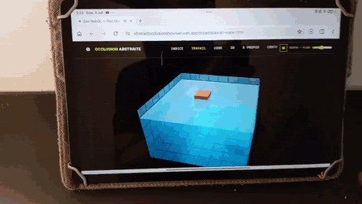
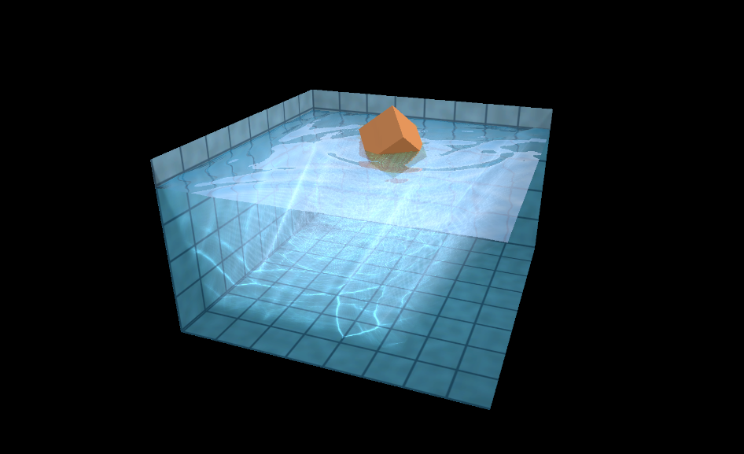
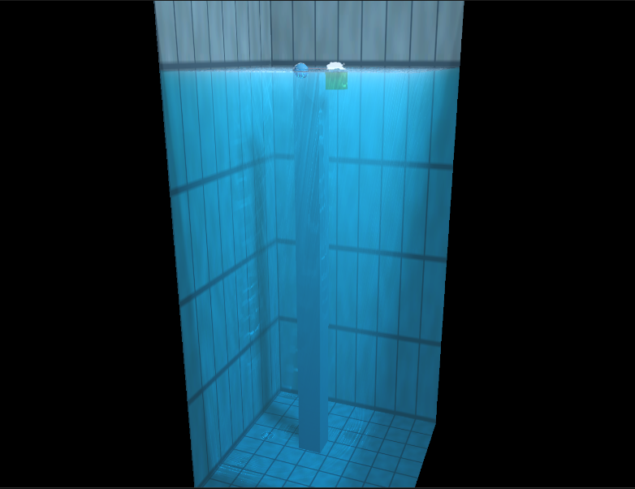
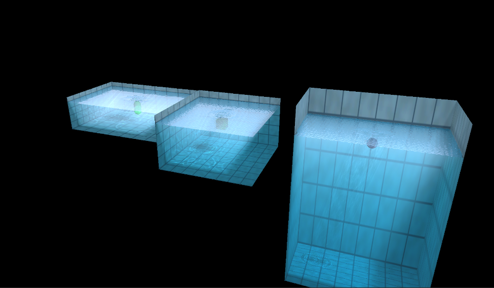
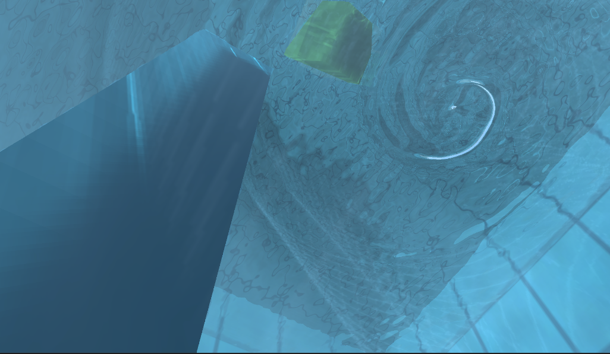
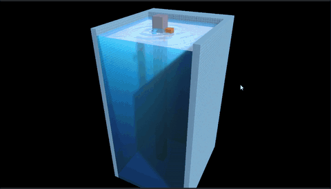
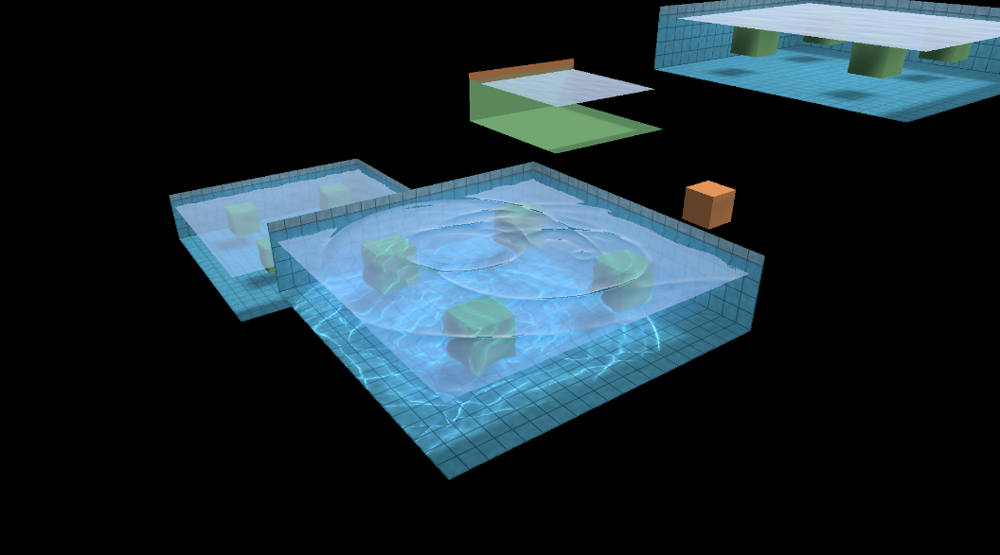

# AbstractOcclusion.WebGpuWater — GPU water for Unity 6 / URP

> **Renders entirely on the GPU via Unity 6 WebGPU (experimental) — so this runs not just on
> desktop but in the browser and on some mobile devices and tablets. Water of this quality
> shipping to the web is the "wait, this runs _here_?" moment. (See it running on a budget
> tablet [below](#runs-on-a-budget-tablet--live-in-the-browser).)**

> **Based on the original [WebGL Water](https://madebyevan.com/webgl-water/) by
> [Evan Wallace](https://madebyevan.com/) (2011, MIT).** The GPU heightfield
> simulation, the in-shader ray-traced reflection/refraction and the projected
> caustics are his ideas, and full credit for that original design belongs to him.
>
> This project *began* as a faithful Unity 6 + URP **port** of that demo, but has
> since grown into a full Unity **adaptation and enhancement** — re-architected
> around real Unity rendering and physics and extended well beyond the original
> feature set. See the original: https://madebyevan.com/webgl-water/ and
> https://github.com/evanw/webgl-water

---


**▶ [Live demo](https://abstractocclusionshowreel.web.app/projects/ewan-water.html)** —
runs in the browser via Unity 6 **WebGPU** (needs a WebGPU-capable browser:
Chrome / Edge, Safari 26+, or the latest Firefox).

An interactive pool of water you can poke and ripple, drop real objects into, and
watch them float — with real-time caustics, reflections and shadows, running on
the GPU inside Unity.

## Runs on a budget tablet — live in the browser



The live **WebGPU** demo running *in a mobile browser* on a **Redmi Pad SE** (Snapdragon 4G-class
SoC, Adreno 610) — an entry-level 2026 tablet — with the GPU heightfield sim, caustics and
reflections all rippling in real time under a finger.
▶ [Watch the full-resolution clip](https://github.com/AbstractOcclusion-gif/Evan-WebGl-Water-Unity-6-URP-Port-/raw/main/docs/demo-phone-tab.mp4).

## Demo gallery

A few of the showcase scenes:

<table>
  <tr>
    <td width="50%" valign="top" align="center">
      <br>
      <sub><b>1. Classic Pool</b> — a floating crate rippling a tiled pool, with projected caustics on the floor.</sub>
    </td>
    <td width="50%" valign="top" align="center">
      <br>
      <sub><b>2. Deep Lake</b> — depth-aware downwelling extinction darkens the water over a deep, submerged pillar.</sub>
    </td>
  </tr>
  <tr>
    <td width="50%" valign="top" align="center">
      <br>
      <sub><b>4. Multi-Lake</b> — several independent water bodies coexist via per-body <code>MaterialPropertyBlock</code>s.</sub>
    </td>
    <td width="50%" valign="top" align="center">
      <br>
      <sub><b>5. Underwater</b> — a submerged view with caustics, god-ray shafts and real screen-space refraction.</sub>
    </td>
  </tr>
  <tr>
    <td width="50%" valign="top" align="center">
      <a href="https://github.com/AbstractOcclusion-gif/Evan-WebGl-Water-Unity-6-URP-Port-/raw/main/docs/deep-custom-pool.mp4"></a><br>
      <sub><b>6. Deep custom pool</b> — a tall, custom-sized body: depth extinction darkens the water with depth, god-ray shafts pierce it, and floating props ripple the surface. <b><a href="https://github.com/AbstractOcclusion-gif/Evan-WebGl-Water-Unity-6-URP-Port-/raw/main/docs/deep-custom-pool.mp4">▶ full-res clip</a></b>.</sub>
    </td>
    <td width="50%" valign="top" align="center">
      <br>
      <sub><b>7. Multi-level pools</b> — several independent bodies sitting at different heights, each with its own surface <code>Y</code>, ripples and caustics.</sub>
    </td>
  </tr>
</table>

## A full Unity adaptation — not just a port

The goal was not to stop at a 1:1 translation of the 2011 demo, but to make it a
*native* Unity citizen and push it further. The original's clever analytic
shortcuts — a single hard-coded ball, faked reflection/refraction of an analytic
pool, a painted-on blob shadow, a hand-typed light vector — have been replaced
with real Unity rendering and physics. The water now lives in an actual scene with
arbitrary objects, real lights and real shadows.

### Enhancements over the original

- **Hybrid real-time reflections** — screen-space reflections (SSR) blended with a
  planar mirror reflection of the live scene, falling back to the sky cubemap; both
  toggleable per material.
- **True transparency** — optional screen-space refraction samples the real scene
  *behind* the surface instead of a faked analytic pool, so anything in the water
  is genuinely visible through it.
- **Two-way object interaction** — the scripted ball is gone. Any object marked
  `WaterInteractable` displaces the surface through a GPU obstacle map (generalising
  the original sphere kernel to arbitrary meshes), and `WaterBuoyancy` reads the
  height field back via `AsyncGPUReadback` so objects float and bob — full two-way
  coupling.
- **Real Unity lighting** — the hand-typed light vector is gone; one Unity
  **directional light** now drives the water surface, the caustics projection and
  real shadows together. Move the sun and everything tracks it.
- **Real shadows & caustics on geometry** — objects cast and receive URP shadows,
  the pool receives them too, and submerged objects catch the projected caustics on
  their own surfaces.
- **Ambient wind waves & foam** — an analytic spectral (JONSWAP-shaped) wind-wave
  layer is composited on top of the interactive ripples (floating objects ride it
  too), with GPU foam along shorelines, at object contact lines and from turbulence.
- **Underwater god-ray shafts** — a caustic-masked additive light volume with hybrid
  real-shadow shafts, so floating objects carve dark beams through the haze.
- **Depth-aware water colour** — per-channel downwelling darkening makes deeper water
  read darker and bluer, and caustics and god rays fade with depth; god rays also haze
  into the view-path fog. All opt-in, with independent per-effect controls.
- **Real terrain lake beds** *(experimental)* — bakes a Unity Terrain heightmap into a bed-depth
  map so the surface shows a true shoreline gradient (clear in the shallows, dark over the
  drop-off) over uneven ground.
- **Deep, rectangular & rotated bodies** — non-uniform volume extent places and sizes
  the water without touching object scales; wave/ripple height is correctly decoupled
  from depth, so deep water no longer spikes.
- **Multiple water bodies** — several independent lakes coexist via per-body
  `MaterialPropertyBlock`s; a floating object is lit by whichever body it's actually in.
- **Showcase scenes** — eight example scenes (classic pool, deep lake, terrain lake,
  multi-lake, underwater, open water, reflections trio, object pool), shipped as an importable
  Package Manager sample.

## Features

- **GPU heightfield simulation** — 256×256 ping-pong float texture driven by a
  compute shader (drop / wave-propagation / normal / obstacle-displacement kernels).
- **Hybrid reflections** — analytic sky → planar → SSR, blended and toggleable.
- **Real transparency** — optional screen-space refraction of the live scene.
- **Two-way object interaction** — GPU obstacle displacement + async-readback buoyancy.
- **Projected caustics** — on the pool floor/walls *and* on submerged objects.
- **Real lighting & shadows** — a Unity directional light drives water, caustics and
  URP shadows; objects cast/receive, the pool receives.
- **Volume conservation** — the surface stays level no matter how hard you ripple it.
- **Reusable orbit camera** — drag to orbit, scroll to zoom.
- **Designer knobs** — wave speed, damping, sub-steps, ripple strength/radius,
  reflection strength, obstacle strength and buoyancy, all exposed in the inspector.
- **One-window authoring** — the **Water Wizard** builds a configured water surface (size,
  analytic pool, god rays, foam particles, surface + edge foam) and can turn your own scene
  objects into floating or interactable props, generating the sky cubemap, light and materials
  for you.

## Requirements

- **Unity 6** (developed on `6000.3.9f1`).
- **Universal Render Pipeline** (`17.3.0`). The base assembly compiles without URP, but the
  water needs URP for its full look (planar reflection, screen-space refraction).
- A GPU that supports **compute shaders** and **RGBAFloat** random-write
  textures (any modern desktop/console GPU; GLES3.1+/Metal/Vulkan on mobile).

## Install

WebGpuWater ships as a UPM package, **`com.abstractocclusion.webgpuwater`**. Add it to a
Unity 6 / URP project by copying the package into your project's `Packages/` folder (embedded),
or via **Window ▸ Package Manager ▸ + ▸ Add package from disk…** pointed at its `package.json`.

## Quick start

1. Let Unity import the package (no console errors expected).
2. Open **AbstractOcclusion ▸ WebGpuWater ▸ Water Wizard**.
3. Set the size and toggle what you want — analytic pool, god rays, foam particles, surface
   foam (and the conditional **edge foam**) — optionally drag scene objects into the list to
   make them **Floatable** or **Interactable**, then press **Create Water Surface**.
4. Press **Play**.

The wizard generates the meshes, materials, a procedural sky cubemap and a fallback tile
texture under `Assets/WebGLWater/Generated/` (in your project, not the read-only package), and
wires up the camera and the `WaterVolume`. One-off utilities — create prefab, add foam particles
to a selection, assign foam textures, upgrade splash materials, add a secondary body — live in
the same window under **Utilities**.

## Demo scenes

The eight example scenes ship as a Package Manager **sample**. In **Package Manager ▸
AbstractOcclusion.WebGpuWater ▸ Samples**, import **Demo Scenes** to drop them — along with the
generated meshes, sky and materials they depend on — into `Assets/Samples/…`.

## Controls

| Action | Result |
| --- | --- |
| Drag on the water | Make ripples |
| Drag the background | Orbit the camera |
| Scroll wheel | Zoom |
| **Space** | Pause / resume the simulation |
| **L** (hold) | Point the sun along the camera view |

> Drop real objects in by giving them a `Rigidbody`, a `Collider`,
> `WaterInteractable` and `WaterBuoyancy` — they'll displace the surface and float.

## Tuning (WaterVolume inspector)

| Knob | Effect |
| --- | --- |
| **Wave Speed** (0.1–2.0) | Propagation stiffness. Higher = faster, livelier waves (stable up to ~2.0). |
| **Damping** (0.90–1.0) | How quickly ripples fade. Lower = choppier; toward 1.0 = glassy. |
| **Steps Per Frame** (1–8) | Simulation sub-steps. More = faster, smoother propagation. |
| **Ripple Strength / Radius** | Size and intensity of a click/drag ripple. |
| **Conserve Volume** | Keeps the surface from drifting up/down as ripples are added. |
| **Reflection Strength** (0–1) | On the water materials. 1 = original Fresnel; 0 = fully see-through. |
| **Obstacle Strength** | How hard submerged objects push the surface down. |
| **Buoyancy** (on `WaterBuoyancy`) | Float strength; higher rides higher. |

> Reflection / transparency toggles live on the **water materials**: *Use Planar
> Reflection*, *Use Screen Space Reflection* and *Real (Screen-Space) Refraction*.
> SSR and refraction need **Depth Texture** + **Opaque Texture** enabled on the URP asset.

> Presets — *calm pond:* waveSpeed ~1.0, damping ~0.99, steps 2.
> *energetic:* waveSpeed 2.0, damping 0.997, steps 3–4, higher ripple strength.

## Using your own pool

The water surface ray-traces an **analytic** pool defined in normalized space:
floor at `y = -1`, walls up to `y = 2/12`, spanning `x,z ∈ [-1, 1]` (1 unit = the
demo's unit). For your own pool's reflections to match, keep it at those
dimensions and assign your tile texture to **WaterVolume ▸ Tiles**.

## How it maps to the original

| Original (`evanw/webgl-water`) | This adaptation |
| --- | --- |
| `water.js` | `WaterSim.compute` (+ generalised obstacle kernel) + `WaterSimulation.cs` |
| `renderer.js` helper functions | `WaterCommon.hlsl` |
| water / cube shaders | `WaterSurface` (hybrid reflection + real refraction) / `PoolWall` (URP, shadow-receiving) |
| sphere shader + ball physics | **removed** — replaced by `WaterInteractable` + `WaterObstacle` + `WaterBuoyancy` for arbitrary objects |
| `updateCaustics` | `Caustics.shader` drawn into a 1024² RT via a CommandBuffer |
| `main.js` (input, camera, physics) | `WaterVolume.cs` + `OrbitCamera.cs` |
| _(new)_ planar reflection | `PlanarReflection.cs` |
| _(new)_ lit objects + caustics + shadows | `WaterReceiver.shader` driven by a real Unity directional light |

There's a more detailed developer guide in the package README
(`Packages/com.abstractocclusion.webgpuwater/README.md`), including the few in-editor tweaks you
may need (face-culling direction, caustic Y-flip, color space).

## Using it in a game

The water is a self-contained **`WaterVolume`** component you drop into any scene; several bodies
coexist (each drives its own sim and pushes per-body state through a `MaterialPropertyBlock`), and
the gameplay primitives are already there — world-space height queries, `AddRipple`, buoyancy and
submersion tests. That makes it usable for contained water in a real **desktop-URP** game today.

Still on the roadmap before it's turnkey for every target: a high-level gameplay event API
(enter/exit water, a clean façade over the internals), many-body performance culling and quality
tiers, scene-view handles for the volume, and hardening the `AsyncGPUReadback` buoyancy path on
WebGPU/mobile (where readback is unreliable, objects sink rather than float). See
[`docs/game-integration-plan.md`](docs/game-integration-plan.md).

## Known limitations

**Scoped to small and mid-size water bodies.** It's a **contained, heightfield** water — built
for pools, ponds and small-to-mid lakes. It simulates vertical displacement only (no breaking
waves). The interactive ripple sim is a fixed-resolution grid over the body, so past roughly
**~20 m** of extent the interactive ripples get coarse and the analytic wind waves stop reading
realistically at that scale. **Large lakes and oceans are out of scope for this version and are
planned as their own dedicated system** — a spectral/FFT ocean with its own wave foam, fog and
Unity-terrain handling, likely on a separate branch (the camera-following sim window,
[`docs/large-water-sim-window-plan.md`](docs/large-water-sim-window-plan.md), keeps mid-size water
crisp but does not turn a pool solver into an ocean). Fully opaque, very large water also needs a
different shading model than the transparent pool path.

**Unity Terrain support is experimental.** The bed-depth bake approximates a shoreline depth
gradient from a Terrain heightmap, but full terrain integration (splat/detail blending, robust
handling of arbitrary terrains) is not there yet — treat it as a preview.

**Reflections don't all scale.** Planar reflection is a second camera render *per body*, so it
does not scale to many bodies — use SSR + a reflection probe for multi-body scenes and reserve
planar for a single hero body.

**Mobile / WebGPU are supported, with graceful degradation.** Where `AsyncGPUReadback` isn't
available, buoyancy falls back to the analytic waterline — objects still float, they just don't
react to interactive ripples or object displacement. The runtime auto-selects the **Low** quality
tier on WebGL/WebGPU/mobile (`WaterQuality.Probe`) and disables a body cleanly if the device lacks
compute shaders or float render textures. GPU foam particles and the wind-wave layer run on the
WebGPU build; foam-particle density scales with the sim grid, so tune it per quality tier for a
matching look between High and Low.

See the package README for the full developer-facing list.

## Credits & License

- **Original concept, design and GLSL shaders:** © 2011 **Evan Wallace** —
  https://madebyevan.com/webgl-water/ — released under the **MIT License**.
- **Unity 6 / URP adaptation and enhancements:** this repository, also released
  under the **MIT License**.

This adaptation is provided in the same spirit as the original. The foundational
design is Evan Wallace's; if you use it, please keep the credit to him for the
original work.

```
MIT License

Copyright (c) 2011 Evan Wallace (original WebGL Water)
Copyright (c) 2026 (Unity 6 / URP adaptation and enhancements)

Permission is hereby granted, free of charge, to any person obtaining a copy
of this software and associated documentation files (the "Software"), to deal
in the Software without restriction, including without limitation the rights
to use, copy, modify, merge, publish, distribute, sublicense, and/or sell
copies of the Software, and to permit persons to whom the Software is
furnished to do so, subject to the following conditions:

The above copyright notice and this permission notice shall be included in all
copies or substantial portions of the Software.

THE SOFTWARE IS PROVIDED "AS IS", WITHOUT WARRANTY OF ANY KIND, EXPRESS OR
IMPLIED, INCLUDING BUT NOT LIMITED TO THE WARRANTIES OF MERCHANTABILITY,
FITNESS FOR A PARTICULAR PURPOSE AND NONINFRINGEMENT. IN NO EVENT SHALL THE
AUTHORS OR COPYRIGHT HOLDERS BE LIABLE FOR ANY CLAIM, DAMAGES OR OTHER
LIABILITY, WHETHER IN AN ACTION OF CONTRACT, TORT OR OTHERWISE, ARISING FROM,
OUT OF OR IN CONNECTION WITH THE SOFTWARE OR THE USE OR OTHER DEALINGS IN THE
SOFTWARE.
```
