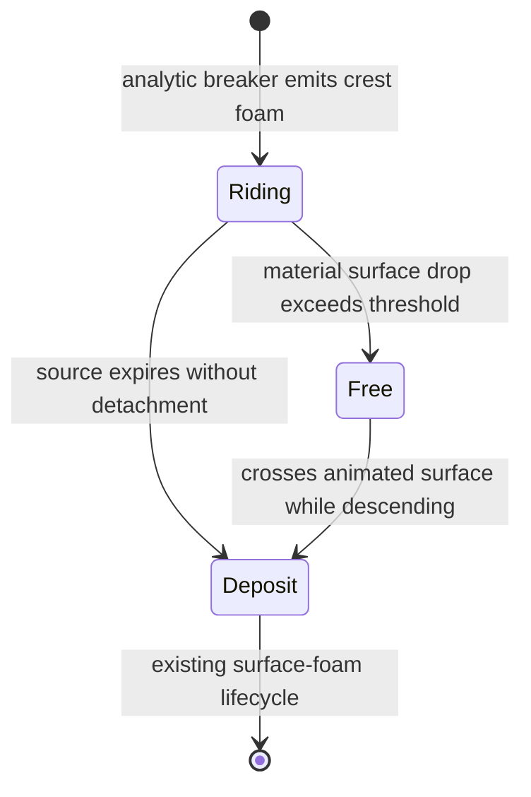

# Crest-rolling foam particles: source audit, KWS1/KWS2 comparison, and architecture

Date: 2026-08-20

Status: research and architecture only; no runtime implementation is authorized by this document

Target: `com.abstractocclusion.webgpuwater` on Unity/WebGPU

Primary comparison sources: local KWS1 and KWS2 source trees supplied by the project owner

## Executive verdict

The crest tests are failing for an architectural reason, not primarily a tuning reason.

The current `KIND_RIPPLE_CREST` path is a good renderer and a good carrier for **interactive ripple crests**. It is not a carrier for the breaking shoreline waves drawn by `WaterSurfWaves.hlsl`. Those waves are a separate analytic height field. No particle source currently reads `SurfWaveSample.breaker` and places a crest particle on that analytic face.

There is a second mismatch. The port currently uses `kind` as both visual identity and motion model:

- `KIND_RIPPLE_CREST` means crest-looking and surface-bound.
- `KIND_SPRAY` means droplet-looking and ballistic.

KWS2 does not make that coupling. A foam particle keeps its foam identity while `isFreeMoving` changes its motion. That separation is what lets foam ride a face, lose support, fall forward, meet the surface again, and continue as foam.

The minimum architecture-correct solution is therefore:

1. Add an **analytic surf-front source** before the ocean ambient early return.
2. Give crest foam a **motion state independent of render kind**.
3. Drive the riding state with the analytic front's own phase velocity.
4. Detect loss of support from the particle's sampled surface-height history.
5. Convert between absolute height and the port's local surface-offset representation during free flight.
6. Keep the existing crest visual path; improve density smearing only after the motion is proven.

This does **not** require a full shallow-water solver for v1. The analytic surf already contains a coherent height, breaker signal, shoreline direction, period, wavelength, and spatial phase warp. It is enough to build an analytic carrier adapter.

---

## 1. What is actually in the project today

### 1.1 There are three different water descriptions

| Water description | Where it lives | What it contains | Current crest-particle use |
|---|---|---|---|
| Interactive ripple simulation | `Sim` and horizontal-flow textures | Local height/velocity response to interactions | Fully used by `KIND_RIPPLE_CREST` |
| Analytic shoreline fronts | `WaterSurfWaves.hlsl` | Height, slope, breaker, whitewash, phase/lifecycle data | Evaluated for surface placement, but not used as a particle source or carrier |
| Ocean FFT | FFT cascade textures | Spectral displacement and accumulated crest foam | Used in composed surface placement; ambient particle spawning is deliberately disabled on the ocean variant |

These representations are composited for rendering, but they do not automatically share dynamics. A particle reading the ripple simulation cannot infer the motion of an analytic surf front merely because both are visible in the final water surface.

### 1.2 Exact spawn order in `WaterFoamParticles.compute`

The current `Spawn` kernel does this:

1. Converts the simulation texel to a world position.
2. Evaluates `TryGetRippleCrestFleckCandidate`.
3. May call `TrySpawnRippleCrestFlecks`.
4. Reads `FoamTex` and executes ambient probability/LOD/slot logic.
5. Under `OCEAN_FFT_GLUE`, returns before writing an ambient particle.

Evidence: `WaterFoamParticles.compute:967-1045`.

The precise conclusion is:

- Ripple-crest flecks **can** spawn on ocean bodies because their branch is before the return.
- CPU/GPU event bursts still have their separate spawn path.
- The ocean variant emits **no ambient FoamTex particles and no old procedural surf-lip droplets** from this branch.
- There is no spawn path whose source is the analytic `SurfWaveSample.breaker` signal.

Therefore, “shore breakers spawn zero particles” is too broad. The accurate statement is: **shore breakers have no particle source tied to their analytic geometry**.

### 1.3 What `KIND_RIPPLE_CREST` really does

The source detector is not trivial. It combines a ripple height peak/curvature stencil, signed and absolute flow coherence, a foam/source condition, flow gates, deterministic world-keyed randomness, and clustered offsets behind/across the local ripple flow. Spawned particles receive:

- `kind = KIND_RIPPLE_CREST`;
- `worldPos.y = 0`, meaning zero offset above the local surface;
- horizontal velocity from the interactive ripple flow;
- a separate previous-position entry for the quad ribbon.

Evidence: `WaterFoamParticles.compute:893-964`.

During update, that kind always stays in the surface-bound branch. It samples `SampleHorizontalFlow`, follows the live ripple flow, adds bounded authored drift, updates its ribbon history, and fades rapidly when the interactive flow disappears. It never becomes ballistic. Evidence: `WaterFoamParticles.compute:1326-1370`.

This is appropriate for wake flecks. It cannot create a shore roller because the required source and carrier are elsewhere.

### 1.4 The analytic surf data already available to the particle compute

`SurfSampleAt` calls the same `EvaluateSurfWaves` used by the surface. The returned `SurfWaveSample` contains:

- `height`;
- `slopeXZ`;
- `whitewash`;
- `breaker`;
- `mask`;
- `overCap`;
- `lipShape`;
- `trailAge`.

Evidence: `WaterSurfWaves.hlsl:533-544` and `WaterFoamParticles.compute:632-644`.

The internal `SurfFrontTerms` also computes `breakType` as spilling/plunging/surging weights, but `SurfWaveSample` does **not** expose it. Evidence: `WaterSurfWaves.hlsl:363-420`. Any design that consumes breaker type must explicitly extend the sample or reconstruct it; it is not available today.

`SurfaceWorldY` already composes the correct animated surface for particles. On the ocean it sums FFT displacement, analytic surf height, and ripple glue; on other bodies it combines the body level, surf height, and ripple/wind glue. Evidence: `WaterFoamParticles.compute:701-740`.

### 1.5 Two suspected missing features are already present

#### Landing

`FoamParticle.worldPos.y` is stored as a height offset above the local animated surface. Spray lands when that offset crosses `SPRAY_LANDING_EPSILON` while descending, then `DepositFrom` turns it into surface foam. Evidence: `WaterFoamParticles.compute:1285-1294`.

The collision test therefore does not need to be replaced with a raw comparison against `SurfaceWorldY`. The surface is already the coordinate frame. A new surf roller does, however, need explicit surface-history compensation while airborne; otherwise a rapidly falling surface continues to move the supposedly free particle's absolute world height.

#### Motion stretching

The quad renderer already stretches spray along velocity and stretches `KIND_RIPPLE_CREST` from `worldPos - CrestFleckPreviousPositions`. Evidence: `FoamParticles.shader:512-581`.

The screen-space density path does not use that history. It writes a compact footprint into one of three projected-size tiers. Evidence: `WaterFoamParticles.compute:1439-1485`.

So the rendering diagnosis is specific: **quad crest ribbons exist; density-mode directional splats do not**. Rendering polish is not the cause of missing shore-face motion.

### 1.6 The architectural failure in one sentence

The system has a ripple source plus a ripple carrier, and it has an analytic shore surface plus a breaker mask, but it has no adapter that turns the analytic surface into a particle source/carrier and no foam motion state that can detach from either carrier.

---

## 2. KWS1: why its shoreline foam looks coherent

Source tree inspected read-only: `C:\Users\bebx\Documents\UnityProjects\KWS1`.

KWS1 and KWS2 must not be treated as one architecture.

### 2.1 KWS1 shoreline waves are authored clips

`KWS_ShorelineWaves.shader` samples an animated displacement/normal/alpha atlas. The source uses a 14 by 15 atlas at 18 FPS and interpolates adjacent frames. Each shoreline-wave instance applies its own position, scale, angle, time offset, and amplitude.

Evidence:

- `KWS_ShorelineWaves.shader:12,21-23,74-75,128-136`.

This is not a live shallow-water breaker. It is a replayed, authored wave animation.

### 2.2 KWS1 shoreline foam is baked particle trajectory data

`KWS_ShorelineFoam_Common.cginc` reads packed `uint2` particle data and count/offset tables, interpolates particle position/alpha between clip frames, transforms the result with the same wave instance, adds the water displacement, and atomically accumulates foam into screen-space buffers.

Evidence:

- packed buffers: `KWS_ShorelineFoam_Common.cginc:25,115-130`;
- frame interpolation and particle lookup: `:186-219`;
- screen-space atomics: `:208-209,282-307`;
- binary buffers loaded by `ShorelineFoamPass.cs:92-102,346-347`.

There is no live crest spawn, no per-frame surface-collapse detector, and no `isFreeMoving` transition in this shoreline path.

### 2.3 What KWS1 gets “for free”

KWS1 gets coherence because wave geometry and foam trajectories come from the same authored event and play with the same instance transform/time. A particle cannot accidentally follow the wrong wave representation: its path was baked for that clip.

This is a legitimate production solution, especially for hero beaches and repeatable set pieces. Its tradeoffs are:

- excellent art direction and predictable rolling silhouettes;
- stable cost and no runtime coastal solver;
- limited response to arbitrary bathymetry and interactions;
- asset production/storage and clip repetition;
- harder continuity between differently placed wave instances.

KWS1's lesson for this port is **shared provenance**: the geometry and secondary effect must be generated from the same wave event. It is not evidence that a ripple simulation can drive an unrelated analytic shore wave.

### 2.4 KWS1's interactive waves do not change that conclusion

KWS1 also contains `KWS_DynamicWaves.shader`, but the inspected path is a separate scalar previous/current height update. It evaluates neighboring heights and a previous frame (`KWS_DynamicWaves.shader:171-202`); it is not the velocity-carrying coastal field that drives the baked shoreline foam. Its existence must not be used to reinterpret KWS1's shoreline roller as a live shallow-water particle simulation.

---

## 3. KWS2: the live field that makes the one-line transition work

Source tree inspected read-only: `C:\Users\bebx\Documents\UnityProjects\KWSWater\Assets\KriptoFX\WaterSystem2`.

The online Asset Store listed KWS2 `1.1.0d`, released 26 June 2026, at this research date. The local source tree is the authority for every code claim below; its exact package version was not independently matched to that store release. [Asset Store release data](https://marketplace.unity.com/packages/tools/particles-effects/kws2-dynamic-water-system-323662).

### 3.1 One coastal state contains both surface and transport

KWS2's dynamic-wave cell stores a `float4` whose relevant channels are:

- `.xy`: horizontal velocity;
- `.z`: water/free-surface height;
- `.w`: terrain/bottom height.

Its solver updates mass/height and velocity, handles drag/advection/vorticity, and carries wet/dry and shoreline information in an additional target. The shoreline direction comes from a signed-distance field built with jump flooding.

For the ocean path, `AddFFTWaves` injects FFT crest displacement into this coastal dynamic field and also adds shore-directed velocity:

```hlsl
center.z  += crestWave * shorelineMask;
center.xy += shorelineMask * shoreDir * crestWave * lerp(2, 0.5, windIncoming);
```

Evidence: `KWS_DynamicWavesHelpers.cginc:294-310`.

That is the crucial difference from this port: the KWS2 particle samples a surface and a velocity that belong to the same evolving coastal representation.

### 3.2 KWS2's foam source is richer than its particle gate

`GetFoamMask` advects and decays the previous foam field, then derives sources from:

- height peak and curvature;
- signed velocity divergence/compression;
- slope;
- curl and shear;
- a Froude-number gate;
- direction of flow relative to shore;
- shallow shoreline and obstacle terms.

The crest source is approximately:

```text
crestPeak     = heightPeak * curvatureGate
compression  = gate(-divergence)
breakingFront = slopeGate * compression
crestFoam     = max(crestPeak, 0.5 * breakingFront)
                * fastFlowFroudeGate
                * incomingToShore
```

Evidence: `KWS_DynamicWavesHelpers.cginc:327-445`.

One source-reading trap matters: the variable named `foamAdvectionScale` is currently computed but not applied to `foamAdvectionOffset`. It must not be credited with depth-scaled advection.

### 3.3 KWS2's particle-spawn “divergence” is not signed divergence

The particle kernel computes:

```hlsl
float divergence = length(right.xy - center.xy)
                 + length(top.xy - center.xy);
```

Evidence: `KWS_DynamicWavesFoamParticlesCompute.compute:302-305`.

This is a local velocity-variation magnitude. It is always non-negative. It is not the signed mathematical divergence used for compression in `GetFoamMask`. The particle gate combines this variation with the persistent foam mask, water height, speed, visibility/distance LOD, and randomized budget. It then emits a compact cluster across and behind the flow direction. Evidence: `:327-391`.

This distinction matters when porting the algorithm. Replacing the analytic breaker signal with an unsigned derivative named “divergence” would not recreate KWS2's physics; it would only recreate one spawn heuristic.

### 3.4 What the famous line actually measures

The exact KWS2 line is:

```hlsl
float previousDeltaHeight = particle.prevPosition.y - particle.position.y;
particle.isFreeMoving = previousDeltaHeight > 2.0;
```

Evidence: `KWS_DynamicWavesFoamParticlesCompute.compute:563-575`.

In the riding branch, KWS2 snaps `particle.position.y = currentHeight` after horizontal advection. Before that update it stores the particle's pre-update position in `prevPosition`. On a later sliced update, `previousDeltaHeight` is therefore the downward displacement of the particle's recently snapped surface trajectory, with the implementation's one-step history lag. It is not a direct comparison to the newly sampled `currentHeight`, and the separately computed `deltaHeight` is unused here.

Why the simple test works visually:

1. The particle was born in a cell with a real dynamic-wave height and velocity.
2. While attached, it moves with that field and is snapped to its height.
3. A collapsing/advected face makes the stored particle trajectory drop.
4. The threshold changes the motion branch while the particle remains foam.
5. The free branch applies gravity/drag and advances the absolute particle position.
6. Surface clamping and the next state evaluation can bring it back to the field.

The line is not a universal breaking-wave detector. It is the final switch on top of a coherent field architecture.

Two more exact details prevent mythology from replacing source truth:

- `isFreeMoving` is overwritten on every foam update; it is not a permanently sticky state.
- A high `waveSpeed` can mark a particle free at spawn, but the later update still recomputes the flag.

### 3.5 KWS2's screen-space foam is accumulation, not active motion ribbons

KWS2 projects one particle into one of three resolution tiers and uses integer atomics to accumulate foam. Its foam motion-smear block is commented out in the inspected source. KWS2's apparent rolling is therefore primarily produced by coherent particle trajectories and dense accumulation, not by a mandatory seven-times motion stretch.

This port already has a stronger individual crest-quad ribbon than the inspected KWS2 foam shader. The missing motion cannot be fixed by copying rendering constants.

### 3.6 KWS2 splash art is not a rolling-wave flipbook

KWS2's separate airborne splash renderer samples `KWS_SplashTex0` from one of four horizontal cells. Spawn selects a static cell with `uvOffset = 0.25 * floor(random * 4)`; the splash shader scales `uv.x` by `0.25` and adds that offset. There is no age-driven frame advance in this path.

The texture channels are packed data for one splash variant: red carries the main mass, green the shine contribution, blue dissolve noise, and alpha depth/soft-fade support. Particle rotation, speed/lifetime size shaping, descent stretch, lighting, fog, and scene-depth fade provide the motion and integration.

Therefore the reusable KWS2 split is:

- wave, ripple, and river foam: shared dynamic-wave particles accumulated into screen-space buffers;
- airborne impact splashes: a separate billboard renderer using four static packed variants;
- no shipped temporal "rolling crest" flipbook to copy.

This port deliberately adds a cyclic 4x4 roller sheet only for the analytic-surf adapter, where no shallow-water carrier exists to create the whole appearance from dense accumulation alone.

---

## 4. KWS1, KWS2, and the current port side by side

| Question | KWS1 | KWS2 | Current port |
|---|---|---|---|
| Shore wave representation | Baked displacement clip | Live shallow-water height/velocity field with FFT injection | Analytic height field in `WaterSurfWaves.hlsl` |
| Foam provenance | Baked trajectories paired with the clip | Generated from the same dynamic field | Ripple crest particles come from a different simulation |
| Crest transport | Baked into trajectory | Dynamic field velocity | Interactive ripple velocity only |
| Detachment | Baked into trajectory | `isFreeMoving` from prior vertical path drop | No crest detachment state |
| Foam identity while free | Encoded by clip/render | Preserved | Ballistic behavior currently implies `KIND_SPRAY` |
| Surface accumulation | Integer atomic screen-space buffers | Three integer-atomic LOD tiers | Three density tiers for ripple crest particles |
| Arbitrary live shoreline response | Limited | Strongest of the three | Analytic geometry responds to shore field, particles do not yet follow it |

The current port sits between KWS1 and KWS2: its wave is procedural like neither KWS1's baked clip nor KWS2's solver, but its analytic phase gives enough kinematic information to build a coherent adapter.

---

## 5. Research that is actually useful

There is no 2024-2026 paper that can be dropped into this WebGPU compute pool and directly produce a KWS2 roller. The recent work improves phase-coherent procedural foam, lifecycle models, and validation. The foundational real-time detachment/secondary-particle mechanics are older and remain relevant.

### 5.1 2026 — phase-native procedural foam

Fournier et al., **Dynamic Wave Trains: A Procedural Approach to Spatially Varying Ocean Synthesis** (Computer Graphics Forum, first published 19 May 2026) uses phase information from spatially controlled procedural wave trains to generate and advect foam at low cost. It explicitly separates active spray near breaking from persistent foam behind the crest.

Use here: treat analytic phase as first-class carrier data. `WaterSurfWaves.hlsl` already has phase `SurfWarpDistance(s) / L + time / T`; the particle source and transport should consume that same phase rather than infer motion from the ripple texture.

Limit: the paper's secondary effect is phase-correlated foam, not the KWS2 ride/free/reland state machine.

Source: [Fournier et al. 2026](https://doi.org/10.1111/cgf.70495).

### 5.2 2025 — useful validation and high-end state ideas

- Bjørnestad et al., **Whitecaps, Bubbles and Advection** distinguishes a short-lived near-surface large-bubble layer closely connected to active breaking from smaller, deeper, longer-lived bubbles advected by currents. Use here: keep active roller particles separate from residual surface foam and bubble-plume systems. [Paper](https://doi.org/10.1029/2025GL117684).
- Callaghan et al., **A Vision-Based Method for Spatial and Temporal Tracking of Individual Whitecaps** measures foam area, breaking speed/direction, and split/merge evolution. Use here: validation metrics for a deterministic capture, not a runtime simulation algorithm. [Paper](https://doi.org/10.1109/TGRS.2025.3555851).
- Stevenson-Regla et al., **Implicit Field-Based Stylization of 2D and 3D Liquid Animations** uses visual-particle states and particle history to create crest, droplet, bubble, and foam shapes. Use here only as support for keeping motion history/state separate from the fluid representation; its implicit reconstruction is too expensive and stylized for this v1. [Paper](https://diglib.eg.org/items/ab0ac9e9-eb7a-43d3-928a-bfc76b5080da).

### 5.3 2024 — foam as a transported layer with a lifecycle

- Malej and Shi, **Modeling the optical signature induced by surfzone bubbles using the Boussinesq-type wave model FUNWAVE-TVD**, adds a bubble/foam thickness variable with breaking-driven growth, advection, and decay rather than resolving a full multiphase flow. Use here: active roller particles should feed a passive residual foam layer; not every mature whitewash element should remain an expensive ballistic particle. [Paper](https://doi.org/10.1016/j.oceaneng.2024.118160).
- Callaghan et al., **A Comparison of Laboratory and Field Measurements of Whitecap Foam Evolution From Breaking Waves**, finds rapid foam-area growth during active breaking followed by decay, with similar normalized early evolution across laboratory and field scales. Use here: validate a growth/peak/decay coverage envelope instead of assigning unrelated random lifetimes. [Paper](https://doi.org/10.1029/2023JC020193).

### 5.4 2022 — physically rich whitewater, not a real-time target

Wretborn, Flynn, and Stomakhin, **Guided Bubbles and Wet Foam for Realistic Whitewater Simulation**, uses discrete bubbles coupled to a sparse volumetric flow and surface-manifold-constrained SPH foam. Use here: conceptual separation of bubbles, wet foam, and carrier constraints. Do not transplant the solver into the WebGPU path. [Paper](https://alexey.stomakhin.com/research/siggraph2022_whitewater.pdf).

### 5.5 2020 — procedural surface kinematics can drive particles

Jeschke et al., **Making Procedural Water Waves Boundary-aware**, drives spray/foam from procedural surface geometry, velocity, and acceleration. Its supplemental particle model allows particles to escape a wave with their initial velocity, then converts spray to foam on collision; foam slides on the surface with high friction.

Use here: a procedural height field does not need a full fluid solver to support secondary particles, provided coherent kinematics are derived from the same field.

Sources: [paper](https://doi.org/10.1111/cgf.14100), [supplemental particle system](https://diglib.eg.org/bitstreams/892cde4c-c10c-4003-bb0d-a384b3a86fa9/download).

### 5.6 2012 — source terms and classification

Ihmsen et al., **Unified Spray, Foam and Air Bubbles for Particle-Based Fluids**, generates secondary particles from wave-crest curvature and trapped-air measures, scaled by kinetic energy, and classifies spray/foam/bubbles from local fluid support. Use here: source strength should combine geometric breaking evidence and energy/transport, and visual phase should be a state rather than an unrelated emitter family.

Limit: its SPH neighbor-density classification is not a good fit for a fixed WebGPU surface pool.

Source: [Ihmsen et al. 2012](https://cg.informatik.uni-freiburg.de/publications/2012_CGI_sprayFoamBubbles.pdf).

### 5.7 2010 and 2007 — the expensive north stars

- Chentanez and Müller, **Real-time Simulation of Large Bodies of Water with Small Scale Details**, converts height-field regions that cannot represent breaking/waterfalls/splashes into particles and exchanges mass/momentum. It is the principled hybrid endpoint, but much larger than the required adapter. [Paper](https://diglib.eg.org/items/d0320015-4b07-416b-8f41-047485c9f7f3).
- Thürey et al., **Animation of Open Water Phenomena with Coupled Shallow Water and Free Surface Simulations** / breaking-wave work detects steep fronts, builds a connected particle sheet, accelerates its crest/top, detaches it under gravity, and creates particles on tip/impact. Use a connected sheet only if the actual water silhouette must overturn. Whitewater rolling alone does not justify the connectivity/flood-fill cost. [Breaking-wave paper](https://matthias-research.github.io/pages/publications/breakingWaves.pdf).

### 5.8 Production contrast: Crest

Crest's production approach generates a persistent scalar foam field from pinched/choppy crests and shallow water and decays it over time. It is excellent for coverage and trails, but it is not a crest-rolling particle mechanism. It supports the same division recommended here: sparse active particles plus a persistent scalar deposit.

Sources: [Crest documentation PDF](https://crest.readthedocs.io/_/downloads/en/stable/pdf/), [shoreline documentation](https://crest.readthedocs.io/en/4.21.2/user/shallows-and-shorelines.html).

---

## 6. Recommended architecture: an analytic surf carrier adapter

### 6.1 Preserve the systems that already work

Keep:

- the fixed pool and dead-slot probing;
- world-keyed spawn randomness and distance LOD;
- the separate crest spawn budget;
- `SurfaceWorldY` as the composed surface evaluator;
- crest quad history/ribbon rendering;
- three-tier integer-atomic density accumulation;
- `DepositFrom` as the final transition to ordinary surface foam;
- the existing ripple-crest source for interactive wakes.

Do not reopen ocean ambient spawning. The new surf source should run before that branch's `OCEAN_FFT_GLUE` return, just as ripple-crest spawning already does.

### 6.2 Separate source, motion state, and visual identity

Conceptually, a particle needs three independent labels:

```text
source:       INTERACTIVE_RIPPLE | ANALYTIC_SURF | future FFT crest
motion state: RIDING | FREE | DEPOSIT
visual kind:  CREST_FOAM | SPRAY_DROPLET | BUBBLE | SURFACE_FOAM
```

A surf roller remains `CREST_FOAM` in both `RIDING` and `FREE`. That is the KWS2 property the current kind switch cannot express.

The cleanest storage is a companion buffer rather than widening the shared 52-byte particle record:

```hlsl
struct CrestRollerState
{
    float previousSurfaceY;
    float previousCarrierHeight;
    uint motionState;
    uint flags;
};
```

This is a 16-byte per-slot buffer, cross-platform-friendly and isolated from all existing draw layouts. At 65,536 particles it costs 1 MiB; at 500,000 it costs about 7.63 MiB. The existing `CrestFleckPreviousPositions` remains dedicated to render history.

Do not encode motion state into the sign of opacity, lifetime, seed, or `kind`. Those shortcuts make rendering, state transitions, and future source adapters brittle.

### 6.3 Analytic surf source

For each existing spawn texel:

1. Call `SurfSampleAt(texelWorld.xz, ...)`.
2. Use `surf.breaker` as the active crest/lip source.
3. Gate with `surf.mask`, valid wet depth, and a named minimum source threshold.
4. Scale stochastic emission by source strength, texel world area, and `DeltaTime`.
5. Place a compact cluster across/behind the front using `toShore` and its perpendicular.
6. Initialize `previousSurfaceY` from the fully composed `SurfaceWorldY`, `previousCarrierHeight` from the analytic surf component, and `motionState = RIDING`.

`lipShape` is timing-free and `whitewash` includes mature bore/trail content, so neither is as clean as `breaker` for the first source. `overCap`, `lipShape`, and `trailAge` become useful later for lifecycle styling and breaker-type variants.

Continuous stochastic emission along an active roller is valid: active breaking continuously entrains air. Use a rate, not a one-time binary event. World-keyed LOD/randomness is required so a moving simulation window does not make the crest sparkle relative to the camera.

### 6.4 Derive the carrier velocity from the exact analytic phase

The surf phase in `SurfComputeFrontTerms` is:

```text
phase(s, t) = SurfWarpDistance(s) / L + t / T
```

An iso-phase crest satisfies `d phase / dt = 0`. Therefore its shore-directed speed is:

```text
c_front(s) = (L / T) / d(SurfWarpDistance)/ds
u_front    = toShore * c_front(s)
```

The existing warp is:

```text
W(s) = s * (1 + compression * exp(-s / reach))
```

so its derivative can be evaluated analytically:

```text
W'(s) = 1 + compression * exp(-s / reach) * (1 - s / reach)
```

This is better than guessing `sqrt(g * depth)` because it exactly follows the phase law that renders the current crest, including the project's near-shore compression. Put this calculation in a shared named helper so geometry, particles, and any CPU mirror cannot drift.

The riding carrier can begin as:

```text
u_carrier = u_front * crestRideTransport
```

`crestRideTransport` is an artist/physics calibration factor because foam transport velocity need not equal phase velocity. Start at phase lock for the architecture test; tune only after source/ride/detach are visible independently.

### 6.5 Detect collapse as a discrete material surface drop

An Eulerian test at a fixed texel is insufficient: the particle is moving along the front. The quantity that mirrors KWS2 is the surface change **along the particle path**.

Keep two related quantities separate:

- `surfaceY` is the fully composed `SurfaceWorldY`; it owns placement, free-flight coordinate conversion, and collision.
- `carrierHeight` is the analytic surf component returned by the surf adapter; it owns the analytic collapse decision.

This prevents an unrelated FFT oscillation or interactive ripple from falsely detaching an analytic shore roller.

For a riding particle with stored analytic carrier height `carrierHeightPrevious`:

```text
xNext            = xCurrent + uCarrier * dt
carrierHeightNext = current SurfSampleAt(xNext).height
surfaceYNext      = current SurfaceWorldY(xNext)
dropRate          = (carrierHeightPrevious - carrierHeightNext) / dt
```

This is a discrete material derivative along the chosen carrier. Detach only when:

- the particle has ridden for a named minimum support time;
- the analytic breaker/source is or was active;
- `dropRate` exceeds a named threshold with hysteresis/debounce.

On detachment:

```text
localHeightOffset = max(0, previousSurfaceY - surfaceYNext)
horizontalVelocity = uCarrier
verticalVelocity = initial value derived from surface history, initially zero for the KWS2-like ledge drop
motionState = FREE
```

The positive local offset is the gap created because the face fell away beneath the foam. Gravity and forward carrier momentum then create the rolling arc. An arbitrary upward launch should not be added until this support-loss mechanism has been observed in isolation.

Whether the particle stays riding or detaches, commit `previousSurfaceY = surfaceYNext` and `previousCarrierHeight = carrierHeightNext` after the decision. A riding particle keeps `localHeightOffset = 0`; a free particle preserves the gap shown above.

KWS2's literal `2.0` threshold is in its own simulation scale and time-slicing regime. A robust project parameter should be normalized against the wave's vertical scale, for example:

```text
normalizedDrop = dropRate / max(localCrestHeight / surfPeriod, minimumVerticalScale)
```

If local crest height is not exposed, `_SurfAmplitude / _SurfPeriod` is a usable first scale. The threshold must be a named setting, not copied as a magic number.

### 6.6 Free flight in a surface-relative coordinate system

The port stores vertical position relative to the surface, but a free particle must preserve an absolute ballistic trajectory while the surface beneath it moves. With `previousSurfaceY` in the companion state:

```text
absoluteY = previousSurfaceY + localHeightOffset
velocityY -= gravity * dt
absoluteY += velocityY * dt
xNext = xCurrent + horizontalVelocity * dt
surfaceYNext = current SurfaceWorldY(xNext)
localHeightOffset = absoluteY - surfaceYNext
previousSurfaceY = surfaceYNext
```

Land when the local offset crosses the named landing epsilon while the particle is descending relative to the surface. Then call `DepositFrom` for v1.

This conversion is the part that a normal spray arc can approximate away but a crest-collapse test cannot: the support surface is intentionally moving fast.

### 6.7 State transition policy

Recommended v1 state machine:



Keep `FREE` sticky until collision in v1. KWS2 recomputes it every update, but its dynamic field and surface clamp absorb that behavior. Explicit hysteresis is easier to test in this analytic adapter and avoids ride/free flicker. A later experiment can allow reattachment on an active bore if video evidence shows it improves the roller.

After landing, `DepositFrom` gives the correct visual handoff but its ordinary surface motion does not contain an analytic shoreward whitewash carrier. If the deposited foam looks stationary, add an `ANALYTIC_WASH` carrier as a later increment; do not block the first ride/free proof on it.

### 6.8 Rendering policy

For the first proof:

- render riding and free roller particles through the existing crest visual path;
- color-code motion state only in a debug variant;
- test quad mode first because its motion ribbon already exists;
- test density mode second;
- add a directional density splat from the same history vector only if the motion is correct but accumulation still looks like round dots.

The density renderer should not decide physics. A particle must follow the same state trajectory in quad and density modes.

---

## 7. Alternatives and when they are justified

### A. Analytic carrier adapter — recommended first

Best fit for the current code. It reuses the exact rendered surf and current pool, has a bounded memory/cost increase, and directly fixes the missing provenance/state architecture.

Risk: analytic phase velocity is not a real water velocity. It can produce a convincing roller but not full undertow, refraction-driven currents, or interaction feedback.

### B. KWS1-style authored clip

Best for one or several hero breaker assets where art direction and repeatability matter more than arbitrary coastline response. Bake particle trajectories and geometry from the same offline event and replay them in lockstep.

Risk: asset pipeline, repetition, and poor response to procedural bathymetry/interactors.

### C. KWS2-style coastal shallow-water field

Best long-term physical architecture if live coastline flow, swash, obstacles, wakes, and rolling foam must all share one carrier. FFT/analytic energy would be injected into a coastal height/velocity field, and particles would sample that field.

Risk: largest implementation and reconciliation cost. The rendered analytic front and solver surface must not double or diverge. KWS2's own documentation does not list WebGPU as an officially supported/tested target, so its buffer/dispatch strategy cannot be copied blindly. [KWS2 documentation](https://kripto289.gitbook.io/kripto289-docs), [Unity Asset Store listing](https://marketplace.unity.com/packages/tools/particles-effects/kws2-dynamic-water-system-323662).

### D. Connected overturning sheet

Use a Thürey-style connected sheet only when the actual silhouette must curl/overhang and the height field's topology is visibly insufficient. It solves a different, larger problem than whitewater rolling.

Risk: connectivity, flood fill, collisions, mass exchange, and geometry generation are unfriendly to the current fixed WebGPU particle path.

---

## 8. Test plan: prove architecture before tuning art

### 8.1 Deterministic test scene

Create one controlled capture configuration:

- flat, constant-slope beach and valid shore SDF;
- one analytic front set with no crest variation;
- fixed camera and resolution;
- deterministic frame seed and fixed simulation timestep;
- interactive ripple crest emission disabled for the capture;
- event bursts disabled;
- ocean whitecap/ambient particle contribution disabled as it is now;
- one render mode at a time.

The goal is observability, not beauty.

### 8.2 Required debug views

Add temporary/debug-only views for:

- analytic `surf.breaker` source mask;
- `toShore` and analytic phase-velocity arrows;
- sampled analytic carrier-height history, composed surface-height history, and normalized drop rate;
- particle state colors: riding, free, deposited;
- per-frame counts: source candidates, successful spawns, riding-to-free transitions, landings, slot-claim failures;
- optional trails of current and prior absolute particle positions.

Without these views, another failed test will still be ambiguous between source, carrier, state, pool, and renderer.

### 8.3 Acceptance gates

Pass them in order; do not tune a later gate while an earlier one fails.

#### Gate 1 — source provenance

- Every analytic roller spawn lies inside the breaker/lip band.
- Disabling interactive ripples does not remove analytic roller spawns.
- Disabling analytic surf removes all analytic roller spawns.
- Moving the camera does not move or reseed the source in world space.

#### Gate 2 — phase lock

- Riding particles travel shoreward with the same front that emitted them.
- Normalized distance from each riding particle to the breaker ridge stays bounded by a named fraction of `faceLen` or wavelength.
- Changing `_SurfCompression`, wavelength, or period changes particle speed coherently with the rendered phase.

#### Gate 3 — loss of support

- No particle is born free unless a deliberately named born-free rule is enabled.
- Riding-to-free transitions occur after the sampled face begins falling along the particle path.
- A non-collapsing translated test wave produces no false detachments.
- The transition remains stable across supported fixed timesteps.

#### Gate 4 — ballistic consistency and landing

- During `FREE`, reconstructed absolute height follows gravity independent of the underlying surf-height change.
- Horizontal momentum remains shoreward-biased.
- The particle crosses to `DEPOSIT` at the animated surface without hovering, tunneling, or popping below it.

#### Gate 5 — visual accumulation

- The same motion passes in quad and density modes.
- Density coverage forms a moving broken band, not a camera-centred cloud or static round stipple.
- Foam-area history has active growth, a peak, and decay; it does not remain at a constant saturated coverage.

### 8.4 Quantitative capture metrics

Record these for A/B comparisons:

- source precision: fraction of births above the breaker-source threshold;
- ridge error: distance from riding particle to analytic breaker ridge divided by wavelength;
- transition delay: time from positive normalized drop to `FREE`;
- free-flight duration and shoreward travel divided by period/wavelength;
- landing error: absolute local surface offset at transition;
- peak active-particle count and slot-claim failure rate;
- projected foam area versus normalized event time;
- frame time for spawn, update, and density kernels separately.

Recent whitecap tracking/lifecycle papers make coverage, translation speed, growth time, and decay time better validation targets than subjective “looks more foamy.”

---

## 9. Implementation increments and current status

Implementation was explicitly authorized after this research pass. The increments remain independently testable:

1. **R0 — instrumentation:** source mask, carrier arrows, state colors, and counters.
2. **R1 — analytic source only:** spawn surface-bound crest particles from `surf.breaker`; no detachment.
3. **R2 — exact analytic carrier:** add shared phase-speed helper and prove phase lock.
4. **R3 — state/history buffer:** add `RIDING/FREE`, material-drop detector, absolute-height conversion, and landing.
5. **R4 — lifecycle handoff:** tune deposit transition and, only if required, add analytic wash transport.
6. **R5 — rendering polish:** directional density splats, clumping, state-dependent size/opacity.
7. **R6 — richer breaker behavior:** optionally expose `breakType`; spilling mostly rides/sheds, plunging gets stronger detachment, surging is suppressed or routed to swash.
8. **R7 — future ocean source:** phase/Jacobian-driven FFT crest particles, independently budgeted from shoreline rollers.

The decisive demo is R3, not R5.

Implemented in the first authorized pass:

- R1: analytic `surf.breaker` source with its own counter and per-frame budget;
- R2: `SurfFrontPhaseSpeed`, derived from the derivative of the exact shore-distance warp;
- R3: companion `CrestRollerState` buffer with `RIDING`, `FREE`, and `DEPOSITED`, collapse-history detachment, absolute-height free flight, and animated-surface landing;
- R4: landing reuses the existing `DepositFrom` lifecycle handoff;
- R5 (partial): analytic rollers keep temporal flipbook quads in both render modes while ordinary ripple flecks remain KWS-style points/density tiers; state-color debug is available.

Still intentionally deferred: directional density stamps, GPU readback counters, breaker-type-specific behavior, and FFT whitecap sourcing.

---

## 10. Failure matrix for the next test

| Symptom | Most likely cause | Evidence to inspect |
|---|---|---|
| No particles on shore wave | Analytic source absent/gated after ocean return | breaker debug mask and source-candidate counter |
| Particles appear only around wakes | Ripple source is still the only active crest source | source label/state color |
| Particles spawn on lip but stay behind or pass through | Carrier speed/direction does not match analytic phase | phase arrows and ridge error |
| Particles ride forever | Carrier-height history not initialized/updated, threshold scale wrong, or carrier samples the same phase forever | previous/current carrier height and normalized drop |
| Particles detach immediately | History invalid at birth, timestep spike, or source test confused with detach test | valid-history flag and minimum support time |
| Free particles still follow the collapsing surface | Local offset integrated without absolute-height compensation | reconstructed absolute-height trail |
| Particle turns into a droplet visually | Motion state encoded as `KIND_SPRAY` | visual kind versus motion-state debug |
| Motion is correct in quads but density looks static | Density splat lacks directional history footprint | compare render modes with identical state buffer |
| Foam looks good only after extreme profile values | Architectural source/state signal still missing | complete Gates 1-4 before profile tuning |
| Camera movement changes the breaker cloud | camera-relative/random spawn key or moving-window history invalidation | fixed world key and world-space capture |

---

## 11. Final recommendation

Build neither “more `KIND_RIPPLE_CREST` tuning” nor a full KWS2 solver first.

Build one narrow bridge: **analytic breaker source → analytic phase carrier → history-based support loss → crest-foam free motion → existing surface deposit**.

That bridge copies the transferable principle from both KWS generations:

- From KWS1: geometry and foam must share the same event/provenance.
- From KWS2: render identity and motion state must be independent, and detachment only works when the particle has ridden a coherent moving surface.

The port already owns most of the difficult infrastructure. The missing part is not more foam gain. It is a particle that actually exists on the analytic shore face, knows how that exact face moves, and is allowed to stop being supported without ceasing to be foam.

---

## 12. Source index

### Local project source

- `Packages/com.abstractocclusion.webgpuwater/Runtime/Shaders/WaterFoamParticles.compute`
- `Packages/com.abstractocclusion.webgpuwater/Runtime/Shaders/WaterSurfWaves.hlsl`
- `Packages/com.abstractocclusion.webgpuwater/Runtime/Shaders/FoamParticles.shader`
- `Packages/com.abstractocclusion.webgpuwater/Runtime/WaterFoamParticles.cs`
- `Packages/com.abstractocclusion.webgpuwater/Runtime/WaterFoamProfile.cs`

### Local KWS1 source

- `C:\Users\bebx\Documents\UnityProjects\KWS1\Assets\KriptoFX\WaterSystem\WaterResources\Shaders\Resources\Common\CommandPass\KWS_ShorelineWaves.shader`
- `C:\Users\bebx\Documents\UnityProjects\KWS1\Assets\KriptoFX\WaterSystem\WaterResources\Shaders\Resources\Common\CommandPass\KWS_ShorelineFoam_Common.cginc`
- `C:\Users\bebx\Documents\UnityProjects\KWS1\Assets\KriptoFX\WaterSystem\WaterResources\Scripts\Core\CommandPass\ShorelineFoamPass.cs`

### Local KWS2 source

- `C:\Users\bebx\Documents\UnityProjects\KWSWater\Assets\KriptoFX\WaterSystem2\WaterResources\Shaders\Resources\Common\CommandPass\KWS_DynamicWaves.shader`
- `C:\Users\bebx\Documents\UnityProjects\KWSWater\Assets\KriptoFX\WaterSystem2\WaterResources\Shaders\Resources\Common\KWS_DynamicWavesHelpers.cginc`
- `C:\Users\bebx\Documents\UnityProjects\KWSWater\Assets\KriptoFX\WaterSystem2\WaterResources\Shaders\Resources\Common\CommandPass\KWS_DynamicWavesFoamParticlesCompute.compute`
- `C:\Users\bebx\Documents\UnityProjects\KWSWater\Assets\KriptoFX\WaterSystem2\WaterResources\Shaders\Resources\Common\CommandPass\KWS_DynamicWavesFoamParticlesShading.shader`
- `C:\Users\bebx\Documents\UnityProjects\KWSWater\Assets\KriptoFX\WaterSystem2\WaterResources\Shaders\Resources\Common\CommandPass\KWS_JumpFloodSDF.shader`

### External references

- [Fournier et al. 2026 — Dynamic Wave Trains](https://doi.org/10.1111/cgf.70495)
- [Bjørnestad et al. 2025 — Whitecaps, Bubbles and Advection](https://doi.org/10.1029/2025GL117684)
- [Callaghan et al. 2025 — Vision-Based Whitecap Tracking](https://doi.org/10.1109/TGRS.2025.3555851)
- [Stevenson-Regla et al. 2025 — Implicit Field-Based Stylization](https://diglib.eg.org/items/ab0ac9e9-eb7a-43d3-928a-bfc76b5080da)
- [Malej and Shi 2024 — FUNWAVE-TVD bubble/foam optical signature](https://doi.org/10.1016/j.oceaneng.2024.118160)
- [Callaghan et al. 2024 — Whitecap foam evolution](https://doi.org/10.1029/2023JC020193)
- [Wretborn et al. 2022 — Guided Bubbles and Wet Foam](https://alexey.stomakhin.com/research/siggraph2022_whitewater.pdf)
- [Jeschke et al. 2020 — Making Procedural Water Waves Boundary-aware](https://doi.org/10.1111/cgf.14100)
- [Ihmsen et al. 2012 — Unified Spray, Foam and Air Bubbles](https://cg.informatik.uni-freiburg.de/publications/2012_CGI_sprayFoamBubbles.pdf)
- [Chentanez and Müller 2010 — Real-time large bodies of water with small-scale details](https://diglib.eg.org/items/d0320015-4b07-416b-8f41-047485c9f7f3)
- [Thürey et al. 2007 — Breaking Waves](https://matthias-research.github.io/pages/publications/breakingWaves.pdf)
- [Crest stable documentation](https://crest.readthedocs.io/_/downloads/en/stable/pdf/)
- [KWS2 documentation](https://kripto289.gitbook.io/kripto289-docs)
- [KWS2 Unity Asset Store listing](https://marketplace.unity.com/packages/tools/particles-effects/kws2-dynamic-water-system-323662)
