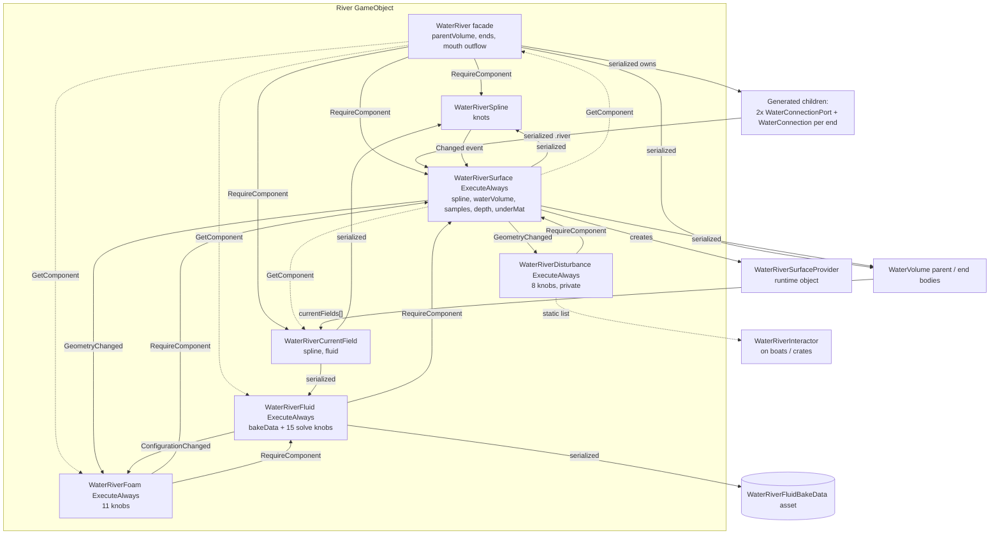

# 04 - River inventory + merged-editor design analysis (2026-09-02)

Read-only. Every claim cites file:line in /tmp/ww. CONFIRMED = every in-tree consumer read
(Samples~ is excluded from the tree, so "no caller" means "no caller in Runtime/Editor/Tests").
PLAUSIBLE = needs an editor/runtime check. No code, no fixes - directions only.

Note: `Runtime/BoatTouchDriver.cs` was listed as "mentions river"; it does not - the only hits
are the word "driver" (lines 5, 13, 26). It is irrelevant to the river track.

---

## 1. COMPONENT MAP

### 1.1 Per-component table

| Component | File | Responsibility (one line) | Serialized fields (grouped) | Attributes / requires | Lifecycle hooks |
|---|---|---|---|---|---|
| **WaterRiver** (facade) | Runtime/WaterRiver.cs | Owns wiring, parent link, generated seam objects, mouth outflow; "deliberately orchestration-only" (lines 5-9) | *Wiring*: `parentVolume` (91). *Ends*: `sourceEnd`, `mouthEnd` = `WaterRiverEndConnection{body, upstreamRiver, transitionRadiusMeters, riverPort, targetPort, connection}` (36-53, 94-97). *Mouth outflow*: `mouthOutflowLengthMeters`, `mouthOutflowSpreadPerMeter`, `mouthOutflowCurrentStrength`, `mouthOutflowFoamLengthMeters`, `mouthOutflowFoamStrength` (99-115) | `[RequireComponent(WaterRiverSpline, WaterRiverCurrentField, WaterRiverSurface)]` (64-65); NOT `[ExecuteAlways]` | Reset (137), OnEnable (145), OnDisable (155), LateUpdate (161), OnValidate (169) |
| **WaterRiverSpline** | Runtime/WaterRiverSpline.cs | Centreline data only ("cannot grow into a river god-object", 3-4) | `knots` List<WaterRiverKnot{localPosition, localTangent, width, speed}> (15-18, 70) | none; NOT ExecuteAlways | Reset (147), OnValidate (149); raises `Changed` (72) |
| **WaterRiverCurrentField** | Runtime/WaterRiverCurrentField.cs | Physical current from spline (+ optional fluid bake); mouth-outflow override | `spline` (18), `fluid` (21) | derives `WaterCurrentField` (9); NOT ExecuteAlways | OnEnable (63, fills `fluid` via GetComponent), Reset (86) |
| **WaterRiverSurface** | Runtime/WaterRiverSurface.cs | Ribbon mesh + fog-volume mesh ownership, renderer wiring, property-block publication, provider registration | `spline` (69), `waterVolume` (71), `samplesPerSegment` (74), `gameplayDepthMeters` (78), `underSurfaceMaterial` (82). The ABOVE material is not a field: it is `MeshRenderer.sharedMaterial` (246) | `[ExecuteAlways]`, `[RequireComponent(MeshFilter, MeshRenderer)]` (15-17) | OnEnable (142), OnDisable (157), OnValidate (169), OnTransformParentChanged (180), OnDidApplyAnimationProperties (182), LateUpdate (186 - publishes every frame) |
| **WaterRiverFluid** | Runtime/WaterRiverFluid.cs | Holds bake settings + the bake asset; publishes packed texture to renderer | *Asset*: `bakeData` (32). *Grid*: `lateralResolution`, `longitudinalResolution`, `iterations` (33-38). *Rasterization*: `obstacleLayers`, `obstacleContactRadius` (40-41). *Solve*: `deltaTime`, `viscosity`, `pressure`, `flowForce`, `velocityDecay`, `vorticity` (43-48). *Foam*: `foamThreshold`, `foamStrength`, `obstacleFoamTrailLengthMeters`, `bankFoamStrength` (49-56) | `[ExecuteAlways]`, `[RequireComponent(WaterRiverSurface)]` (7-9) | OnEnable (65), OnDisable (73), OnValidate (81) |
| **WaterRiverFoam** | Runtime/WaterRiverFoam.cs | Contact + cascade + baked-turbulence foam composition, cascade transport curve, after-fog overlay registration | *Sources*: `overallStrength`, `strength`, `contactStrength`, `contactDepth`, `cascadeStrength`, `cascadeStartAngle`, `cascadeFullAngle`, `cascadePersistenceMeters` (40-57). *Appearance*: `patternSize`, `edgeFeather`, `coreCut` (59-63) | `[ExecuteAlways]`, `[RequireComponent(WaterRiverSurface, WaterRiverFluid)]` (7-9) | OnEnable (98), OnDisable (107), OnValidate (119) |
| **WaterRiverDisturbance** | Runtime/WaterRiverDisturbance.cs | Analytic wake / pile-up / impact displacement from `WaterRiverInteractor`s; CPU + shader source | `maximumDisplacement`, `minimumRelativeSpeed`, `fullRelativeSpeed`, `wakeLengthScale`, `foamStrength`, `normalSampleDistance`, `minimumSurfaceUp`, `fullSurfaceUp` (58-74; **private**, not `internal`) | `[ExecuteAlways]`, `[DefaultExecutionOrder(-50)]`, `[RequireComponent(WaterRiverSurface)]` (7-10) | OnEnable (100), OnDisable (110), OnValidate (118), LateUpdate (137 - RebuildSources every frame) |
| **WaterRiverInteractor** | Runtime/WaterRiverInteractor.cs | Lives on the OBJECT (boat/crate), not the river: bounds + velocity + impact ring source | `rendererOverride`, `colliderOverride`, `radiusOverride`, `strength`, `radiusScale`, `wakeLengthScale`, `foamStrength`; impact ring: `impactStrength`, `impactDuration`, `impactPropagationSpeed`, `impactWidth` (32-56) | `[ExecuteAlways]`, `[DefaultExecutionOrder(-100)]` (8-9) | OnEnable (75), OnDisable (82), OnValidate (88), LateUpdate (102) |
| **WaterRiverFluidBakeData** | Runtime/WaterRiverFluidBakeData.cs | ScriptableObject bake output (packed RGBAHalf texture + arc-length lookup) | `packedTexture`, `lateralResolution`, `longitudinalResolution`, `riverLength`, `maximumSpeed`, `normalizedDistanceByParameter` (17-22) | `[CreateAssetMenu]` (10) | asset, no lifecycle |
| WaterRiverSplineEvaluator | Runtime/WaterRiverSplineEvaluator.cs | Pure static cubic evaluation + projection | none | static | - |
| WaterRiverRibbonMeshGenerator | Runtime/WaterRiverRibbonMeshGenerator.cs | Pure static mesh populate (seams, shared boundary row) | none | static | - |
| WaterRiverFluidSolver | Runtime/WaterRiverFluidSolver.cs | Pure static settled-fluid solve | none | static | - |
| WaterRiverSurfaceProvider | Runtime/WaterRiverSurfaceProvider.cs | `IWaterSurfaceProvider` face for one surface (created in `WaterRiverSurface.OnEnable`, 153) | none (plain class) | - | - |

### 1.2 Who references whom

Serialized references (survive in the scene):
- `WaterRiver.parentVolume` -> WaterVolume (WaterRiver.cs:91); `sourceEnd/mouthEnd.body` -> WaterVolume, `.upstreamRiver` -> WaterRiver, `.riverPort/.targetPort` -> WaterConnectionPort, `.connection` -> WaterConnection (36-53).
- `WaterRiverSurface.spline` -> WaterRiverSpline, `.waterVolume` -> WaterVolume (69, 71).
- `WaterRiverCurrentField.spline` -> WaterRiverSpline, `.fluid` -> WaterRiverFluid (18, 21).
- `WaterRiverFluid.bakeData` -> WaterRiverFluidBakeData asset (32).
- Reverse links held elsewhere: `WaterConnectionPort.river` -> WaterRiverSurface (Runtime/WaterConnectionPort.cs:26); `WaterVolume.currentFields[]` gets the river field appended by the builder (Editor/WaterBuildKit.River.cs:108-121) and at play by the facade (WaterRiver.cs:225-248).

Runtime `GetComponent` discovery (sibling-only, never serialized):
- WaterRiver.CacheSiblings: spline, currentField, surface, fluid, foam (WaterRiver.cs:190-197).
- WaterRiverSurface: `GetComponent<WaterRiver>()` for outflow + end anchors (668, 715); `ResolveCurrentField` = own `WaterRiverCurrentField`, else the spline's (392-397).
- WaterRiverFluid/Foam/Disturbance: `GetComponent<WaterRiverSurface>()` (Fluid 120; Foam 294-295 also Fluid; Disturbance 459).
- WaterRiverCurrentField.OnEnable/Reset: `GetComponent<WaterRiverFluid>()` (67, 89), `GetComponent<WaterRiverSpline>()` (88).
- WaterRiverInteractor: Collider/Renderer/Rigidbody on itself/children/parent (206-210).

Event wiring: Spline.Changed -> Surface.RequestRebuild (Surface 419); Surface.GeometryChanged -> Foam.Refresh (Foam 102), Disturbance.HandleGeometryChanged (Disturbance 104), downstream Surface's source boundary (Surface 345); Fluid.ConfigurationChanged -> Foam.Refresh (Foam 103). The facade subscribes to NOTHING (grep `Changed +=` over Runtime: only Surface/Foam/Disturbance).

### 1.3 Required vs optional

- REQUIRED (facade's RequireComponent, WaterRiver.cs:64-65): WaterRiverSpline, WaterRiverCurrentField, WaterRiverSurface (+ MeshFilter/MeshRenderer from the surface's own RequireComponent).
- OPTIONAL add-ons on the river object: WaterRiverFluid (requires Surface), WaterRiverFoam (requires Surface + Fluid), WaterRiverDisturbance (requires Surface). The facade editor offers Add buttons only for Fluid and Foam (Editor/WaterRiverEditor.cs:74-84); Disturbance has NO custom editor and no add button (grep `CustomEditor(typeof(WaterRiver` -> 5 editors: CurrentField, River, Fluid, Foam, Spline).
- OPTIONAL on other objects: WaterRiverInteractor (no custom editor), WaterRiverFluidBakeData asset (created by the baker, Editor/WaterRiverFluidBaker.cs:187-193).

### 1.4 Dependency graph

Lifecycle caveat worth knowing before designing the editor (CONFIRMED by attributes, effect PLAUSIBLE): the facade, spline and current field are NOT `[ExecuteAlways]`, while Surface/Fluid/Foam/Disturbance are. In edit mode the facade's OnEnable/LateUpdate never run; its seams and outflow reach the surface only through `OnValidate` (WaterRiver.cs:169-188) and explicit `RegenerateConnection` (485). Moving the river root in the editor fires the change router (Editor/WaterRiverAuthoringChangeRouter.cs:24-49), which only notifies spline/surface - nothing re-aims the generated target port (`SyncGeneratedConnectionAnchors` is called from OnValidate only, WaterRiver.cs:185).

---

## 2. EDITOR MAP

| Editor | Target | Draws | Buttons / actions | Undo / dirty | Notes |
|---|---|---|---|---|---|
| **WaterRiverEditor** (Editor/WaterRiverEditor.cs, internal) | WaterRiver | `parentVolume` + standalone HelpBox (53-57); "Optional Components" (67-90); "Mouth Outflow" 5 fields (92-101); per-end `body`, `upstreamRiver` (source only), `transitionRadiusMeters` + status HelpBox (103-119) | Add Fluid Bake / Add Foam (`Undo.AddComponent`, 77-83); Generate/Update Connection, Remove Connection (128-138) | Good: `Undo.RecordObject` on river + prior objects, `RegisterCreatedObjectUndo` only for created objects, `SetDirty` (149-169, 175-180). `ApplyModifiedProperties` before the facade reads (132) | Uses raw `EditorGUILayout.LabelField(..., boldLabel)` sections, NOT `WaterEditorUI.Section` - visually unlike the volume inspector. `GenerateEnd/RemoveEnd` are `internal static` and are reused by both builders (WaterBuildKit.River.cs:56, ConnectedWatersDemo.cs:212, 291, 297) - this is the seam a merged editor must keep |
| **WaterRiverSplineEditor** (Editor/WaterRiverSplineEditor.cs, **public**) | WaterRiverSpline | HelpBox + raw `knots` list PropertyField (42-43) | Add Knot / Remove Last (48-61) | `RecordObject` + `SetDirty` (50-59); scene handles via SerializedProperty + `ApplyModifiedProperties` on change (73-76) | Owns OnSceneGUI (knot/tangent/width handles, 65-155) and the `[DrawGizmo]` bank preview (157-184). The only river editor with scene tooling |
| **WaterRiverCurrentFieldEditor** (Editor/WaterRiverCurrentFieldEditor.cs) | WaterRiverCurrentField | HelpBox, `spline`, `fluid`, missing-spline warning (22-31) | none | SerializedObject only | Help text still says "Add this field to the Water Volume's Motion > Currents list" (16-19) - the facade/builder now does that automatically (WaterRiver.cs:225-248; WaterBuildKit.River.cs:108-121). Stale guidance |
| **WaterRiverFluidEditor** (Editor/WaterRiverFluidEditor.cs, CanEditMultipleObjects) | WaterRiverFluid | 4 `WaterEditorUI.SubHeading` groups: Bake Grid / Obstacle Rasterization / Fluid Solve / Generated Foam (49-69); warnings + bake status line (78-94) | Bake Settled Fluid (73-76) -> `WaterRiverFluidBaker.Bake` | `Undo.IncrementCurrentGroup` + group name (104-105); baker records the fluid (Baker 68-70). No `CollapseUndoOperations`; the created asset is not undoable (acceptable) | The most "volume-like" river editor (uses WaterEditorUI). `bakeData` itself is NOT drawn - the asset is invisible in the inspector unless the user switches to Debug mode (grep `bakeData` in the editor: none) |
| **WaterRiverFoamEditor** (Editor/WaterRiverFoamEditor.cs, CanEditMultipleObjects) | WaterRiverFoam | SubHeadings Sources / Appearance (39-51); warnings for missing fluid / bake / volume (62-84) | none | SerializedObject only | `strength` relabelled "Baked Turbulence Strength" (47) - the field name and label disagree |
| (none) | WaterRiverSurface | default inspector | - | - | `samplesPerSegment`, `gameplayDepthMeters`, `underSurfaceMaterial`, `spline`, `waterVolume` are only reachable through the default inspector; the above material only through MeshRenderer |
| (none) | WaterRiverDisturbance, WaterRiverInteractor | default inspector | - | - | fields have Tooltips (Disturbance 57-74, Interactor 31-56) so the default inspector is usable |
| **WaterRiverFluidBaker** (Editor/WaterRiverFluidBaker.cs, static) | - | - | `Bake(fluid)`: arc samples, Physics.CheckSphere rasterization, solve, save asset under `Assets/WebGpuWater/RiverFluidBakes` (13-14, 187-193) | `Undo.RecordObject(fluid)` + `SetDirty` (68-70) | Work cap `MaximumSolveCellIterations = 20M` (23, 150-157) |

### 2.1 Duplication across river editors and vs WaterVolumeEditor / WaterEditorUI

- Section chrome: WaterRiverEditor draws sections with `EditorGUILayout.Space()` + `LabelField(..., EditorStyles.boldLabel)` (69-70, 94-95, 106-107) while Fluid/Foam editors use `WaterEditorUI.SubHeading` (Fluid 49, 55, 59, 64; Foam 39, 48). WaterVolumeEditor uses `WaterEditorUI.Section/SubSection/SectionWithToggle` everywhere (e.g. Body.cs:24, 90, 113). Three different section languages for one feature.
- `DrawProperty(string)` helper is written twice: WaterRiverFluidEditor.cs:78-79 and WaterRiverFoamEditor.cs:56-57 (Foam adds a labelled overload 59-61). WaterVolumeEditor has the same idea as `DrawFields(params string[])` (Inspector.cs:302-306). CONFIRMED three copies of "find property by name and draw it".
- Property-name string constants are retyped per editor (Fluid 13-27, Foam 13-23, River 17-21, Spline 11-15, CurrentField 11-12) with no river equivalent of `WaterVolumePropertyPaths` (Editor/WaterVolumePropertyPaths.cs:17). Per its own scope rule (lines 9-14) single-use paths may stay inline, but `spline` is drawn by the CurrentField editor and read by the change router (`surface.spline`, Router 46) and the facade (`_surface.spline =`, WaterRiver.cs:209) - three consumers of one field name.
- Bake-status line is drawn twice: Fluid editor 88-93 (`BakeStatusFormat` with speed) and Foam editor 77-83 (`BakeStatusFormat` without speed). CONFIRMED duplicate readout.
- "Missing spline" warnings appear in three places: CurrentField editor 20-21, Fluid editor 33-34, and the facade's `WarnOnInvalidSetup` (WaterRiver.cs:726-727).
- Add-component rows: WaterRiverEditor 74-84 (adds) vs WaterVolumeEditor.Interaction `DrawComponentRow<T>` 55-68 (discovers + selects, never adds). Two policies for "optional sibling component".
- Optional-component gate logic is written twice: WaterRiverEditor 76-83 (`fluid != null`, `foam != null || fluid == null`) and ConnectedWatersDemo `AddProceduralRiverFoam` 305-314.

### 2.2 Change routing

1. Inspector edits: each component's `OnValidate` clamps and re-publishes (Surface 169-178 -> `RequestRebuild` + `ConfigurationChanged`; Fluid 81-87; Foam 119-138; Disturbance 118-135; Spline 149-153 -> `Changed`; facade 169-188 -> `ApplyWiring` + `SyncGeneratedConnectionAnchors` + `SyncSeams` + `SyncMouthOutflowRegistration`).
2. Scene-view transform edits: `WaterRiverAuthoringChangeRouter` (Editor/WaterRiverAuthoringChangeRouter.cs) hooks `Undo.postprocessModifications` (18), and for EVERY modified Transform in the scene calls `GetComponentsInChildren<WaterRiverSpline>(includeInactive)` and `<WaterRiverSurface>` (32-39), then `NotifyChanged` / `RequestRebuild` (43-46). Cost is per undo record for any transform in the scene, not just rivers (PLAUSIBLE editor cost on large scenes; CONFIRMED it is not filtered by river ancestry).
3. Live preview: `WaterEditorPreviewDriver` pumps the player loop at 60 Hz while `WaterVolume.ActiveBodyCount > 0` (Editor/WaterEditorPreviewDriver.cs:50-61). Rivers ride on it: `WaterRiverSurface.LateUpdate` publishes every tick (Surface 186) and `WaterRiverDisturbance.LateUpdate` rebuilds sources (Disturbance 137). A standalone river with NO WaterVolume in the scene gets no pumping (gate is `ActiveBodyCount`, 53) - consistent with the "standalone ribbon" warning but worth stating in the merged editor.
4. Programmatic: `spline.Changed` -> surface rebuild -> `GeometryChanged` -> foam/disturbance/downstream stitch (see 1.2).

### 2.3 Undo / dirty quality

- Facade editor: exemplary (records reused objects, registers only created ones, SetDirty; WaterRiverEditor.cs:142-181).
- Spline editor: correct (RecordObject + SetDirty for buttons, SerializedProperty for handles).
- Fluid bake: `Undo.IncrementCurrentGroup` without `CollapseUndoOperations` (Fluid editor 104-106); baker records the fluid (Baker 68). Minor.
- Builders: `WaterBuildKit.River.CreateRiverRig` sets fields directly on freshly added components (`spline.knots =` 85, `currentField.Configure` 88, `surface.Configure` 95, `facade.parentVolume =` 100) - fine because the GameObject itself is `NewUndoableGameObject` (81); `AppendCurrentFieldSerialized` records the body (114). `CreateRiverFromMenu` collapses the group (61).
- Runtime facade mutating serialized state outside the editor: `RegenerateConnection` writes `end.riverPort/targetPort/connection` and child transforms (520-542) - the editor records first (WaterRiverEditor 149-152). Tests call `RegenerateConnection` directly (Tests/Runtime/WaterRiverFacadeFeatureTests.cs:101, 111, 129, 149, 191, 220, 270) so the runtime entry point must stay.

---

## 3. FACADE ASSESSMENT

### 3.1 What the facade already is

`WaterRiver` is an orchestration facade by design, not a settings facade: "every setting keeps living on the component that consumes it" (WaterRiver.cs:5-6). It owns exactly three concerns of its own: the parent link (`parentVolume`, 91), the two end connections (94-97) and the mouth-outflow tuning (99-115). Everything else it does is push/pull wiring:
- `ApplyWiring` (202-217): fill-null `currentField.spline`, `surface.spline`; push `surface.waterVolume = parentVolume`.
- `Reset` (137-143): adopt `parentVolume` from `surface.WaterVolume` when null.
- `SyncSeams` (553-564): push `BodySeamEnd` descriptors + source-boundary target into the surface (runtime-only state, Surface 115-120).
- `AttachCurrentFieldToParent` (225-248): append the current field to `parentVolume.currentFields` and to the mouth body when different (play-mode only - not ExecuteAlways).
- `TryBuildMouthOutflow` (306-385): reads spline terminal, fluid bake, foam strengths, surface metrics, and combines them with the facade's own five knobs.

### 3.2 Settings that still live ONLY on sub-components (not reachable from the facade inspector)

| Setting | Owner | Facade exposure |
|---|---|---|
| `knots` | Spline (70) | none (facade has `Spline` accessor only, 128) |
| `samplesPerSegment`, `gameplayDepthMeters`, `underSurfaceMaterial` | Surface (74-82) | none |
| above material | MeshRenderer.sharedMaterial (Surface 246) | none |
| `spline`, `waterVolume` on Surface | Surface (69, 71) | `waterVolume` is DRIVEN by `parentVolume` (212-216); `spline` fill-null only (207-211) |
| `spline`, `fluid` on CurrentField | CurrentField (18, 21) | `spline` fill-null (206); `fluid` never touched by the facade (CurrentField fills it itself in OnEnable/Reset 67, 89) |
| all 16 Fluid fields incl. `bakeData` | Fluid (32-56) | none; facade reads `BakeData` (321-322) |
| all 11 Foam fields | Foam (40-63) | none; facade reads `strength`, `overallStrength`, `patternSize`, `edgeFeather`, `coreCut`, `TransportLength`, `TransportedCascadeAtMouth` (351-373) |
| all 8 Disturbance fields | Disturbance (58-74) | none; facade does not even cache it (CacheSiblings 190-197 caches fluid/foam only) |

### 3.3 Mirrored / duplicated state (drift risk)

- **Parent volume, two copies**: `WaterRiver.parentVolume` (91) and `WaterRiverSurface.waterVolume` (71). The facade is declared the authority and overwrites the surface in `ApplyWiring` (212-216) - but only when the facade's OnValidate/OnEnable runs. Any test or script that sets `surface.waterVolume` directly (Tests: WaterRiverGameplayFeatureTests.cs:145, 160; WaterRiverFoamFeatureTests.cs:234, 386) bypasses the facade. The Foam and Fog paths read the SURFACE copy (Foam 300; Surface 597-599, 638); the connection validation reads the FACADE copy (508). CONFIRMED two sources of truth with a one-way sync.
- **Spline reference, three places**: facade `GetComponent` (192), `surface.spline` (69), `currentField.spline` (18). ApplyWiring only fills nulls (206-211), so a surface pointing at a foreign spline is legal and never corrected; the change router keys on `surface.spline` (Router 46).
- **Fluid reference, two places**: `currentField.fluid` (21) vs facade `_fluid` from GetComponent (195). Both self-resolve to the sibling; the serialized one can be pointed elsewhere.
- **Mouth-foam appearance fallbacks**: facade constants `DefaultMouthFoamPatternSizeMeters = 1f`, `DefaultMouthFoamEdgeFeather = 0f`, `DefaultMouthFoamCoreCut = 0f` (77-79) shadow Foam's `DefaultPatternSize = 2f`, `DefaultEdgeFeather = 0.15f`, `DefaultCoreCut = 0.5f` (Foam 14-16) with DIFFERENT values. They are only used when `_foam == null` (368-373), and in that case `foamCoverage` is forced to 0 (360), so the values are inert. CONFIRMED harmless-but-misleading duplication.
- **Half-width**: `terminal.Width * 0.5f` inline (378) vs six `const float HalfWidth = 0.5f` copies (see section 6).

### 3.4 What `Configure` does vs what the builder does vs what the facade does

- `WaterRiverSurface.Configure(spline, body, surfaceMaterial, underMaterial, samples)` (Surface 228-255): validates the shader name, sets the five surface inputs including `MeshRenderer.sharedMaterial`, rebinds spline events, rebuilds, publishes. The 4-argument overload (224-226) has NO in-tree caller (grep `surface.Configure(`: only WaterBuildKit.River.cs:95 with five args). CONFIRMED unused overload.
- `WaterRiverCurrentField.Configure(spline)` / `(spline, fluid)` (CurrentField 70-81): sets references with null check. The two-arg form is used only by a test (Tests/Runtime/WaterRiverFoamFeatureTests.cs:202).
- `WaterRiverFoam.Configure(float maskStrength)` (Foam 142-148): NO caller anywhere. CONFIRMED dead.
- `WaterBuildKit.CreateRiverRig` (Editor/WaterBuildKit.River.cs:76-104) does what the facade cannot: adds the components in dependency order with the facade LAST (comment 74-75), assigns knots, chooses materials (`ctx.MatAbove/MatUnder`), calls `surface.Configure`, then `facade.ApplyWiring`, then appends the current field to the body SERIALIZED with Undo (108-121). `CreateRiverFromMenu` (30-62) additionally picks the parent (selection -> `WaterVolume.Resolve()`), builds shared assets, and connects the mouth via `WaterRiverEditor.GenerateEnd` (57).
- The facade itself never: adds components, assigns materials, seeds knots, or writes the parent's `currentFields` in a serialized/undoable way (play-mode append only, 225-248). So today "create a river" = builder; "configure a river" = five inspectors; "connect a river" = facade editor.

---

## 4. THE MODEL - how WaterVolumeEditor is organized

Structure (Editor/WaterVolumeEditor*.cs, 11 partials, 2189 lines):
- `WaterVolumeEditor.cs` (162): `[CustomEditor]`, gizmo + scene handles only.
- `WaterVolumeEditor.Inspector.cs` (355): orchestration - foldout state fields (32-98), SessionState persistence via ONE `SyncFoldouts` list (117-197), `OnInspectorGUI` = header -> body-type selector -> Jerlov -> presets -> `TabBar` -> one `switch` per tab -> footer (205-280), `Prop()` / `DrawFields()` / `DrawFieldsIf()` helpers (295-332), advisory applicability flags (312-324).
- One partial per tab with a one-line charter each (Inspector.cs:11-16): Body, Motion, Surface, Volume, Interaction, Budget; plus Chunk, Jerlov, Presets as single sections.
- `WaterEditorUI` (Editor/WaterEditorUI.cs): `DrawHeader/DrawFooter` (22-57), `Section` (64-82), `SectionWithToggle` (88-115), `SubHeading` (118-122), `SubSection` (126-141), `TabBar` (146-152), `BodyTypeSelector` (155-168), palette + metrics in one `Style` class (285-316).
- `WaterVolumePropertyPaths` (Editor/WaterVolumePropertyPaths.cs): registry of paths used from more than one place (rule at 9-14).

### 4.1 Reusable pattern list a river editor should follow

1. One orchestration partial + one partial per tab, each tab named for a CHARTER not a feature (Inspector.cs:7-16). River charters fall out naturally: *Course* (spline/knots/samples), *Flow* (current, fluid bake, mouth outflow), *Surface* (materials, depth, foam, disturbance), *Connections* (parent, ends), *Bake/Budget* (resolutions, iterations, bake status).
2. `WaterEditorUI.DrawHeader(title, subtitle)` + `DrawFooter()` (Inspector.cs:209, 277) - the subtitle can carry the river's status (parented / standalone / connected ends) the way the volume's carries primary/secondary (344-348).
3. `WaterEditorUI.TabBar` + `switch` (222-275), tab index persisted in SessionState (106, 112).
4. `Section` / `SubSection("Advanced")` with foldout bools persisted through a single `SyncFoldouts` list (117-197) - "ONE list drives both directions" (115-116).
5. `SectionWithToggle` bound to a bool property for on/off features (Budget.cs:55-56, Volume.cs:19, 61, 88). Rivers have no bool toggles today - the on/off is component presence (Fluid/Foam/Disturbance). The pattern still applies if the merged editor treats "component present" as the toggle (see 5).
6. `DrawFields(params string[])` honouring `[Range]/[Min]/[Tooltip]` so the editor "holds no range literals" (Inspector.cs:300-306). The river editors already follow this (Fluid/Foam `DrawProperty`).
7. `DrawFieldsIf(condition, ...)` greying rather than hiding (327-332; Budget.cs:35, 46, 51) - e.g. grey fluid solve knobs until a spline exists, grey outflow knobs until the mouth end is generated.
8. Explicit button-driven presets, never on a tick (Inspector.cs:334-342; Body.cs:49-70). River analogue: "Apply calm stream / rapids defaults".
9. Read-only readouts as `LabelField(miniLabel)` computed from the target (Motion.cs:219-233, 245-260) - river analogues: ribbon vertex count, river length, mouth flow rate, bake dimensions (already partly in Fluid editor 88-93).
10. HelpBox-with-fix-hint for guarded states instead of silent greying (Body.cs:50-55, Chunk.cs:30).
11. The "missing path throws on unfold" rule (Body.cs:114-117) -> a river property-path registry for any path used by two files.
12. Component-row discovery for sibling components with a Select button (Interaction.cs:55-68) - never adds/removes silently. The river editor's existing "Add Fluid Bake / Add Foam" buttons (WaterRiverEditor.cs:74-84) should keep adding, but through the same row shape.
13. Keep scene-view handles in the base partial (`WaterVolumeEditor.cs:109-155`) - the river equivalent is the whole of `WaterRiverSplineEditor.OnSceneGUI` (65-155) and its `[DrawGizmo]` (157-184).
14. `RequiresConstantRepaint` gated narrowly (Inspector.cs:199-203) - the river editor should NOT repaint continuously; the preview driver already pumps.

### 4.2 Parts of the volume editor NOT worth copying

- Look presets (Presets.cs) and Jerlov (Jerlov.cs): the river inherits its look from `parentVolume` (Surface 638-639 `WriteBodyProps`), there is no river look domain to preset. Skip.
- `BodyTypeSelector` + "Apply defaults" (Inspector.cs:212-214): no river archetype enum exists; inventing one just to fill the header is scope creep. A single "Apply defaults" button is enough if wanted.
- The 60+ foldout bools (Inspector.cs:32-98): the river has ~50 fields total; six to eight sections suffice. Do not replicate the bool-per-fold sprawl - but DO replicate the single Sync list for whatever folds exist.
- Advisory `contentEnabled` greying by body type (Budget.cs:69, 84): rivers have no type; grey by component presence / spline validity instead.
- Chunk section's null-guarded `Prop()` calls (Chunk.cs:23, 33, 39, 51, 54) - defensive against absent runtime partials; the river runtime is a single file per component so a missing path is a bug, not a config.

---

## 5. DESIGN OPTIONS for the merged river editor

Common requirements any option must satisfy (from the tree):
- Keep `WaterRiverEditor.GenerateEnd/RemoveEnd` as `internal static` entry points - both builders call them (WaterBuildKit.River.cs:57, ConnectedWatersDemo.cs:212, 291, 297).
- Keep `WaterRiverSplineEditor.OnSceneGUI` + `[DrawGizmo]` behaviour (Spline editor 65-184); it targets `WaterRiverSpline`, so either keep that editor for scene-only duties or move OnSceneGUI onto the facade editor (facade already `RequireComponent`s the spline).
- Keep `RegenerateConnection`, `ApplyWiring`, `TryBuildMouthOutflow` runtime-callable (tests: FacadeFeatureTests 101-270; FoamFeatureTests 316).
- Sub-component inspectors cannot simply disappear: Unity still shows Spline/CurrentField/Surface/Fluid/Foam/Disturbance as components. The choices are (i) leave them with default inspectors, (ii) give them a minimal "edited on Water River" stub editor, or (iii) `[HideInInspector]`-style hiding via `hideFlags` set by the facade (risky: HideFlags.HideInInspector on components is persisted and confuses prefab diffs).

### Option A - single WaterRiverEditor drawing nested SerializedObjects of the siblings

Mechanics: the facade editor creates a `SerializedObject` per sibling component found via `GetComponent` (facade already caches them, WaterRiver.cs:190-197), draws their properties in tabs, and calls `Update/ApplyModifiedProperties` on each per frame. This pattern already exists in the tree for assets (Editor/WaterFoamProfileEditor.cs:361-368 `new SerializedObject(component)` + `ApplyModifiedProperties()` = "Undo + dirty on the component"), and for the wizard (WaterWizardWindow.cs:434, 472, 501, 547).

Files touched: Editor/WaterRiverEditor.cs (becomes partials: `.Inspector`, `.Course`, `.Flow`, `.Surface`, `.Connections`, `.Bake`), Editor/WaterRiverSplineEditor.cs (keep scene tooling; reduce or remove its OnInspectorGUI), Editor/WaterRiverFluidEditor.cs, Editor/WaterRiverFoamEditor.cs, Editor/WaterRiverCurrentFieldEditor.cs (delete or stub), new Editor/WaterRiverPropertyPaths.cs (paths used by >1 file). Optionally a new `WaterEditorUI.DrawComponentRow` shared with WaterVolumeEditor.Interaction.

Runtime touched: none required. Optional tiny changes: make Disturbance fields `internal` for consistency (Disturbance 58-74 are private - SerializedObject does not care, only tests/builders do).

Backward compat: zero scene migration; every serialized field keeps its owner, name and GUID-linked component. Demo scenes open unchanged. Prefab overrides continue to apply per component.

Risks: (1) multi-object editing gets awkward (one SerializedObject per sibling per target; Fluid/Foam editors are `[CanEditMultipleObjects]` today, 10/10) - acceptable to drop multi-edit for the facade. (2) OnValidate on the sibling fires per `ApplyModifiedProperties`, exactly as today. (3) A sibling that is missing (Fluid not added) must draw the Add row instead of a null SerializedObject - the current editor already handles this (WaterRiverEditor.cs:71-89). (4) If the user selects only the spline (e.g. via the Scene handle) they still land on the spline's own inspector - keep it minimal with a "Edit on Water River" ping button.

### Option B - move all serialized settings onto WaterRiver; sub-components become pure workers

Every field to move (43 excluding the interactor, which lives on foreign objects and must stay):
- Spline: `knots` (Spline 70).
- CurrentField: `spline`, `fluid` (18, 21) - would become derived (sibling), not moved.
- Surface: `spline`, `waterVolume` (derived), `samplesPerSegment`, `gameplayDepthMeters`, `underSurfaceMaterial` (74-82) + above material (still on MeshRenderer).
- Fluid: `bakeData`, `lateralResolution`, `longitudinalResolution`, `iterations`, `obstacleLayers`, `obstacleContactRadius`, `deltaTime`, `viscosity`, `pressure`, `flowForce`, `velocityDecay`, `vorticity`, `foamThreshold`, `foamStrength`, `obstacleFoamTrailLengthMeters`, `bankFoamStrength` (32-56).
- Foam: `overallStrength`, `strength`, `contactStrength`, `contactDepth`, `cascadeStrength`, `cascadeStartAngle`, `cascadeFullAngle`, `cascadePersistenceMeters`, `patternSize`, `edgeFeather`, `coreCut` (40-63).
- Disturbance: `maximumDisplacement`, `minimumRelativeSpeed`, `fullRelativeSpeed`, `wakeLengthScale`, `foamStrength`, `normalSampleDistance`, `minimumSurfaceUp`, `fullSurfaceUp` (58-74).

Every test/builder that sets them directly (must be rewritten):
- `spline.knots =`: Tests SplineFeatureTests 37, 58, 83, 101; RibbonFeatureTests 336, 525; FoamFeatureTests 504, 521; FacadeFeatureTests 43; DisturbanceFeatureTests 155; CurrentFieldFeatureTests 155; ApronFeatureTests 37; QueryFeatureTests 33; GameplayFeatureTests 37; Editor WaterBuildKit.River.cs 85.
- `surface.spline =`: RibbonFeatureTests 326, 378, 458; QueryFeatureTests 41; GameplayFeatureTests 45; FoamFeatureTests 198, 233, 291, 385; DisturbanceFeatureTests 163; WaterRiver.cs 209 (facade itself).
- `surface.samplesPerSegment =`: RibbonFeatureTests 327, 379, 459; DisturbanceFeatureTests 164. `surface.gameplayDepthMeters =`: RibbonFeatureTests 380. `surface.waterVolume =`: GameplayFeatureTests 145, 160; FoamFeatureTests 234, 386; WaterRiver.cs 214.
- `field.spline =`: CurrentFieldFeatureTests 135; `field.Configure(...)`: CurrentFieldFeatureTests 161, FacadeFeatureTests 168, FoamFeatureTests 202, WaterBuildKit.River.cs 88.
- `surface.Configure(...)`: WaterBuildKit.River.cs 95. `fluid.AssignBakeData`: FoamFeatureTests 200, 237; Baker 69.
- `foam.<field> =`: FoamFeatureTests 296, 300, 310-313.
- Readers that would also change: Fluid `Spline`/`SamplesPerSegment` (Fluid 62-63, used by Baker 44, 53); Disturbance reads `_surface.samplesPerSegment` (Disturbance 395, 412, 428); Foam reads `_surface.Spline`, `_surface.WaterVolume` (192, 300); Surface's spline-event binding (414-426).
- Plus: many tests build rivers WITHOUT a facade (e.g. RibbonFeatureTests 319-366 use Surface alone; QueryFeatureTests 23-46 Surface + Spline; CurrentFieldFeatureTests 129-162 field + spline only) - B breaks the ability to use a sub-component standalone, or forces every worker to fall back to a facade lookup.

Backward compat: every demo scene and user scene loses its river tuning unless a migration is written (`[FormerlySerializedAs]` cannot move a field across components; needs an editor-time migration pass like Editor/WaterSplashPrefabMigration.cs or an `ISerializationCallbackReceiver` bridge). The `WaterConnectionPort.river` link (Runtime/WaterConnectionPort.cs:26) targets `WaterRiverSurface`, so the surface component must remain anyway. High cost, high risk, and it contradicts the facade's own charter (WaterRiver.cs:5-6) and the spline's "not a god-object" note (Spline 3-4).

### Option C - hybrid

Nested-SerializedObject editor (A) for everything that exists today, PLUS a small, deliberate set of runtime clean-ups that reduce the "which copy wins" ambiguity without moving tuning fields:
1. Treat `surface.spline`, `currentField.spline`, `currentField.fluid`, `surface.waterVolume` as facade-owned wiring: the merged editor draws them read-only (greyed, `DrawFieldsIf(false, ...)`) under a "Wiring (facade-managed)" Advanced fold, mirroring WaterVolumeEditor.Body "Wiring & References (scene builder)" (Body.cs:113-134), and `ApplyWiring` becomes assign-always for the spline instead of fill-null (WaterRiver.cs:206-211) so the three spline copies cannot diverge. Tests that set `surface.spline` without a facade keep working.
2. Move the two mouth-outflow foam fallbacks and the inline `Width * 0.5f` to shared constants (cosmetic).
3. Keep sub-component inspectors as one-line stubs: a HelpBox "Tuned on the Water River component" + a Select/ping button, except the spline editor which keeps OnSceneGUI + gizmo and the knot list (users select knots from the scene; a stub without the list would strand them).

Files touched: as A, plus Runtime/WaterRiver.cs (ApplyWiring semantics, 202-217) and optionally Runtime/WaterRiverDisturbance.cs (`internal` fields).

Backward compat: same as A (no serialized moves). The ApplyWiring change only rewrites a surface/current-field spline reference that points at a NON-sibling spline - a configuration no builder produces (WaterBuildKit.River.cs:84-95) and no test relies on (all tests use the sibling).

### Recommendation: **C** (A plus wiring ownership), not B

Reasons: (1) The facade's architecture note explicitly forbids B ("every setting keeps living on the component that consumes it", WaterRiver.cs:5-6) and the spline's does too (Spline 3-4); the owner's stated goal is a consolidated INSPECTOR, which A/C deliver without touching serialization. (2) The tree already contains the A mechanism (FoamProfileEditor 361-368; wizard 434-547) and the presentation kit (WaterEditorUI) - the merged editor is mostly relocation. (3) B rewrites ~50 test lines across 9 test files and 2 builders, needs a scene migration for the demo scenes, and still cannot remove WaterRiverSurface (WaterConnectionPort.river). (4) C's one runtime change closes the real drift hazard (three spline copies, two volume copies) that A alone would leave visible in a "Wiring" fold.

### 5.1 River settings that should NOT be in the editor (runtime-derived)

- Surface: `SourceLongitudinalMeters`, `MouthLongitudinalMeters`, `MouthRight` (Surface 99-101, 128-130), `_sourceBodySeam/_mouthBodySeam` and `_sourceBoundaryTarget` (117-120) - facade-pushed, edit-time recomputed. Show as read-only readouts at most.
- Foam: `_cascadeTransportSamples`, `_cascadeTransportLength`, `_transportedCascadeAtMouth` (Foam 69-72) - rebuilt on every GeometryChanged.
- Fluid: `Spline`, `SamplesPerSegment` (Fluid 62-63) - derived from the surface.
- CurrentField: `_mouthOutflow` (23) - facade-pushed per frame.
- Disturbance: `_sources`, `_rowDistanceMeters`, `_sourceCount` (76-82).
- Facade: `_currentFieldHost`, `_mouthCurrentFieldHost`, `_mouthOutflowHost` (124-126).
- Wiring references listed in C.1 should be visible but read-only.

### 5.2 Hidden states that need explicit UI

- **Generated ribbon mesh + fog-volume mesh** (Surface 86-87, `HideFlags.DontSave` 434, 505): invisible in the scene file; the inspector should show vertex/row counts and a "Rebuild" button (calls the public `RequestRebuild`, 189) plus the last rebuild error (currently only a console `LogError`, 220).
- **Underside twin child** "River Surface Under (generated)" (Surface 36, 750-762, DontSave): present only when `underSurfaceMaterial` is set; the editor should say so next to the field.
- **Bake asset** `WaterRiverFluid.bakeData` (Fluid 32): not drawn by WaterRiverFluidEditor (grep `bakeData` in that file: none). Needs an ObjectField + "Bake / Re-bake / Ping asset" + stale detection (bake dimensions vs `lateralResolution/longitudinalResolution`, river length vs current spline length - the data exposes `RiverLength`, BakeData 27).
- **Generated ports + connection children** per end (WaterRiver.cs:50-53): already summarised in a HelpBox (WaterRiverEditor 114-119); add Select buttons to the three objects and the `PortId`.
- **Parent `currentFields[]` membership**: written serialized by the builder (WaterBuildKit.River.cs:108-121) but appended at play by the facade (225-248). A river created by hand (AddComponent) is NOT in the parent's list at edit time. The editor should show "listed in <parent>.currentFields: yes/no" with a fix button that calls the builder's append.
- **External foam overlay registration** (Foam 298-316) and **provider registration** (Surface 153-154, 161): runtime-only; show as status text.
- **Interactors in range**: `WaterRiverDisturbance.SourceCount` (84) - a live readout while a Disturbance exists.
- **Live preview dependency**: standalone rivers get no edit-mode ticking (WaterEditorPreviewDriver.cs:53 gates on `WaterVolume.ActiveBodyCount`). Say it in the standalone HelpBox.

---

## 6. CODE-QUALITY NOTES (top 10, against the owner's standards)

1. **Dead API on WaterRiverFoam** - `Configure(float maskStrength)` (Runtime/WaterRiverFoam.cs:142-148), `BakedTexture` (74), `RiverLength` (75): zero call sites in Runtime/Editor/Tests (grep `foam.Configure`, `.BakedTexture`, `foam.RiverLength`: none). CONFIRMED in-tree (Samples~ excluded). Direction: delete, or route the merged editor's bake readout through them if a single source is wanted.
2. **Unused overload** - `WaterRiverSurface.Configure(spline, body, material, samples)` 4-arg (Runtime/WaterRiverSurface.cs:224-226); only the 5-arg form is called (Editor/WaterBuildKit.River.cs:95). CONFIRMED. Direction: delete the 4-arg form.
3. **Triple per-frame mouth-outflow build** - `TryBuildMouthOutflow` (5x `GetPixelBilinear` when a bake exists, WaterRiver.cs:329-339) runs from `WaterRiver.LateUpdate` (161-167), from `WaterRiverSurface.LateUpdate -> PublishRendererProperties -> PublishMouthOutflowProperties` (Surface 186, 668-671), and again from `WaterVolume.RefreshRiverMouthOutflowShaderData` (Runtime/WaterVolume.Currents.cs:230-232) because `WaterRiver.LateUpdate` invalidates the volume's frame cache every frame (WaterRiver.cs:164). CONFIRMED redundancy; cost PLAUSIBLE-small. Direction: build once per frame in the facade and hand the struct to surface and volume.
4. **Six copies of `HalfWidth = 0.5f`** - Runtime/WaterRiverCurrentField.cs:11, WaterRiverDisturbance.cs:39, WaterRiverSurfaceProvider.cs:27, WaterRiverRibbonMeshGenerator.cs:23, Editor/WaterRiverFluidBaker.cs:20, WaterRiverSplineEditor.cs:28 - plus the inline `terminal.Width * 0.5f` (WaterRiver.cs:378). CONFIRMED. Direction: one `WaterRiverSpline.HalfWidthFraction` (or a `HalfWidth` property on `WaterRiverSplineSample`).
5. **Four arc-length walks over the spline** - ribbon generator (WaterRiverRibbonMeshGenerator.cs:158-189), disturbance row lookup (WaterRiverDisturbance.cs:417-449), foam cascade transport (WaterRiverFoam.cs:213-249, 256 samples), fluid baker (Editor/WaterRiverFluidBaker.cs:83-100). Same `Vector3.Distance(previous, sample.Position)` accumulation each time; the ribbon generator already computes `distances[]` and the metrics struct (80-108) could carry it. CONFIRMED duplication. Direction: expose the generator's row-distance table (or a spline-level cached arc-length lookup invalidated on `Changed`) and have Disturbance/Foam/Baker consume it.
6. **Duplicated helpers** - `ProjectAabbExtent` in WaterRiverDisturbance.cs:462-465 and WaterRiverInteractor.cs:197-200 (identical bodies); `EnabledFeature/DisabledFeature = 1f/0f` in Surface 38-39, Fluid 29-30, Foam 35-36, Disturbance 40-41. CONFIRMED. Direction: one internal static helper / one shared feature-flag pair (WaterShaderProps is the natural home).
7. **Magic numbers in WaterRiverFluid** - `obstacleContactRadius = 0.1f` inline (Runtime/WaterRiverFluid.cs:41) with no `Default...` const unlike every neighbour (19-28); `0.0001f` appears twice as the delta-time floor (43, 132) without a named constant. `WaterRiverFoam` uses `DefaultStrength` as a RANGE MAXIMUM in `[Range(0f, DefaultStrength)]` (Foam 39, 41, 62) - a default doubling as a limit. CONFIRMED. Direction: `DefaultObstacleContactRadiusMeters`, `MinimumDeltaTimeSeconds`, `MaximumStrength`.
8. **Stale comment / missing refresh** - `WaterRiverSurface.ResolveCurrentField` says it is "Re-run by OnValidate through RequestRebuild's callers when the spline reference changes" (Surface 389-391) but it is called only from `OnEnable` (152; grep `ResolveCurrentField`: 152, 392). Changing `spline` in the inspector leaves `_currentField` pointing at the old spline's field until re-enable. CONFIRMED by call sites; visible effect PLAUSIBLE. Direction: call it from `RebindSplineEvents` when the subscribed spline changes.
9. **Change router scope** - `WaterRiverAuthoringChangeRouter.RouteTransformChanges` runs `GetComponentsInChildren<WaterRiverSpline>(includeInactive)` and `<WaterRiverSurface>` for EVERY Transform in every undo modification batch (Editor/WaterRiverAuthoringChangeRouter.cs:28-39), river or not; and it never re-aims generated ports (facade `SyncGeneratedConnectionAnchors` is OnValidate-only, WaterRiver.cs:185). CONFIRMED scope; editor cost and stale-port symptom PLAUSIBLE. Direction: early-out unless the transform has a river in its ancestry (`GetComponentInParent<WaterRiver>`), and route to the facade (`SyncGeneratedConnectionAnchors` + `SyncSeams`) as well.
10. **Public surface inconsistencies** - `WaterRiverSplineEditor` is `public sealed` (Editor/WaterRiverSplineEditor.cs:9) while every other river editor is `internal`; `WaterRiverFoam.RequestRebuild` is `public` (Foam 140) but its only callers are tests (FoamFeatureTests 239, 297, 301, 314, 390) which already have `InternalsVisibleTo` (Runtime/AssemblyInfo.cs:7); `WaterRiverDisturbance` fields are `private` while every sibling's are `internal` (Disturbance 58-74 vs Foam 40-63). `WaterRiverCurrentFieldEditor`'s help text still instructs the user to add the field to the volume's Currents list by hand (Editor/WaterRiverCurrentFieldEditor.cs:16-19) although the builder and facade do it (WaterBuildKit.River.cs:108-121; WaterRiver.cs:225-248). CONFIRMED. Direction: `internal` the editor and `RequestRebuild`, `internal` the disturbance fields, rewrite the help text (or delete the editor under option C).

Bonus (not counted): the facade's three mouth-foam fallback constants (WaterRiver.cs:77-79) are inert - they are only read when `_foam == null` (368-373), and that branch forces `foamCoverage = 0` (360) so pattern/feather/coreCut never reach the shader. CONFIRMED. Direction: drop them and pass zeros, or read them from the foam type's defaults.
